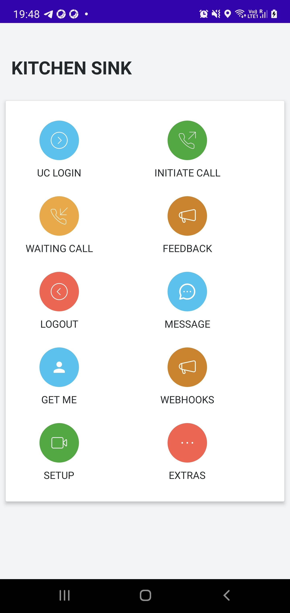
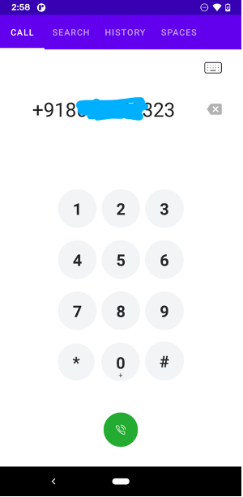
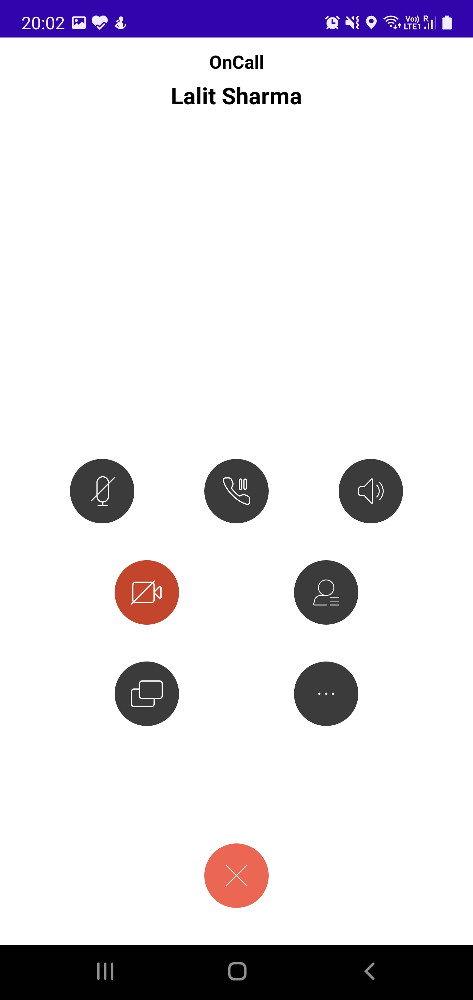
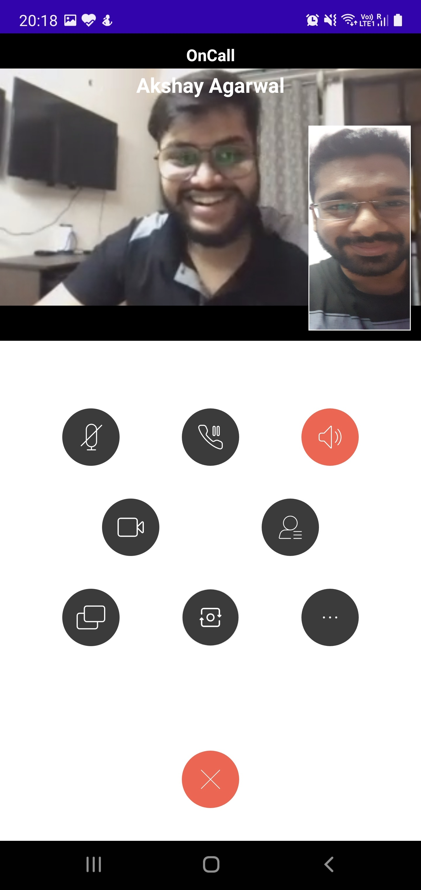
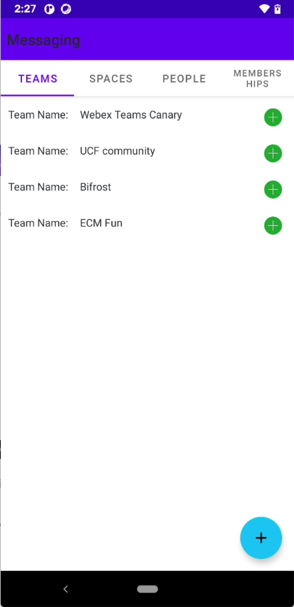
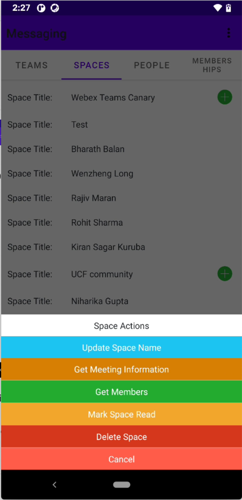
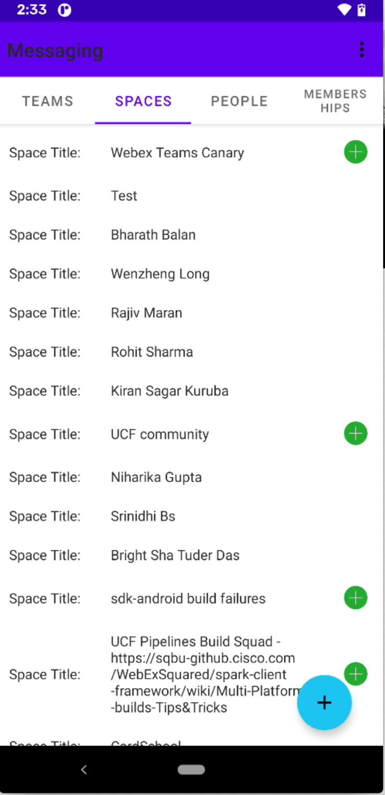
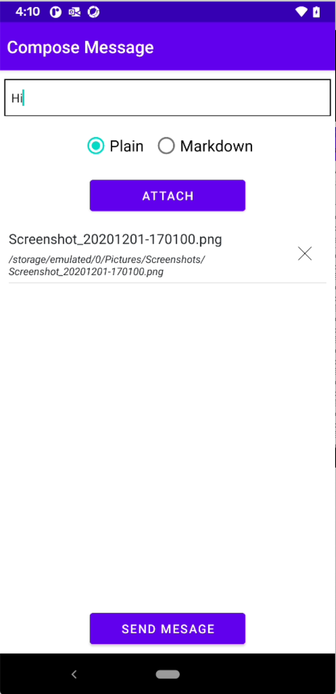

# Cisco Webex Android SDK Example

This *Kitchen Sink* demo employs Cisco Webex service through [Webex Android SDK](https://github.com/webex/webex-android-sdk).  It provides a developer friendly sample implementation of Webex client SDK and showcases all SDK features. It focuses on how to call and use *Webex-SDK* APIs. Developers could directly cut, paste, and use the code from this sample. It basically implements *Webex-SDK* APIs by sequence.

This demo support Android device with **Android 7.0** or later

## Table of Contents

- [Integration](#integration)
- [Usage](#usage)
- [Note](#note)


## Screenshots 
<ul>








</ul>

1. ScreenShot-1: Main page of Application, listing main functions of this demo.
2. ScreenShot-2: Initiate call page.
3. ScreenShot-3: Show call controls when call is connected.
4. ScreenShot-4: Video calling screen
5. ScreenShot-5: Teams listing screen
6. ScreenShot-6: Space related option screen
7. ScreenShot-7: Space listing screen
8. ScreenShot-8: Send Message screen

## Integration

### Option 1
1. Put AAR file in libs folder of your Android project
2. Open the project level Gradle file and add the following lines under the repositories tag, which is nested under allprojects.

      ```
      allprojects {
        repositories {
            jcenter()
            google()
            flatDir { dirs 'aars'} //add this line
        }
      }
      ```
3. Add the following dependency in module level Gradle file and press sync-now
   
    - For Full SDK
      ```
        implementation files('libs/WebexSDK.aar')
      ```
    - For Meeting SDK
      ```
        implementation files('libs/WebexSDK-Meeting.aar')
      ```
    - For WebexCalling SDK
      ```
        implementation files('libs/WebexSDK-Wxc.aar')
      ```
### Option 2

   1. Add the following repository to your top-level `build.gradle` file:
        ```
        allprojects {
            repositories {
                jcenter()
                maven {
                    url 'https://devhub.cisco.com/artifactory/webexsdk/'
                }
            }
        }
        ```
   2. Add the `webex-android-sdk` library as a dependency for your app in the `build.gradle` file:

       - For Full SDK
         ```
         dependencies {
             implementation 'com.ciscowebex:webexsdk:3.13.0'
         }
         ```
       - For Meeting SDK
         ```
         dependencies {
         implementation 'com.ciscowebex:webexsdk-meeting:3.13.0'
         }
         ```
       - For WebexCalling SDK
         ```
         dependencies {
         implementation 'com.ciscowebex:webexsdk-wxc:3.13.0'
         }
         ```

## Usage

For example see [README](https://github.com/webex/webex-android-sdk/blob/master/README.md)

## Note

 Please update the below constant in gradle.properties
 ```
 SCOPE=""
 ```

 Please update below constants in local.properties file
 ```
 CLIENT_ID=""
 CLIENT_SECRET=""
 REDIRECT_URI=""
 WEBHOOK_URL=""
 ```
