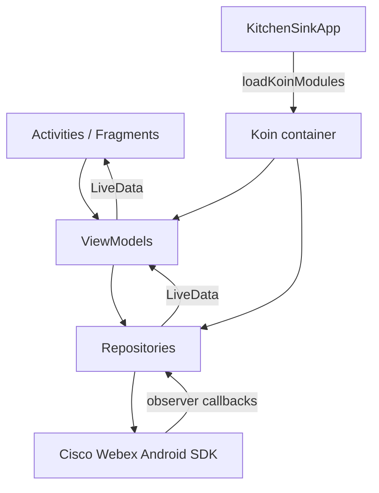
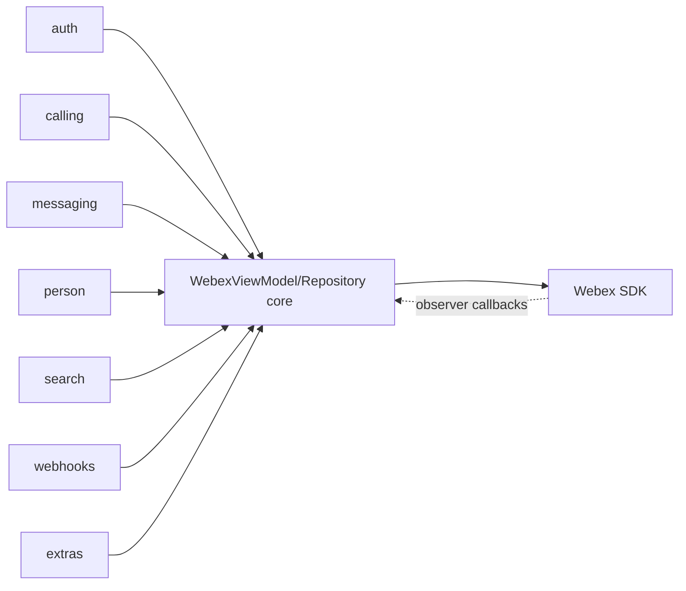

<!-- sdd-generated-metadata
doc_kind: standing-doc
generated_from: architecture@0.2.1
generated_by: claude-cli
approved_by: pending
updated_at: 2026-07-31T00:00:00Z
validation_status: not-run
-->
# ARCHITECTURE — kitchenSink

> Start here → root [`AGENTS.md`](../AGENTS.md) (agent entry) · router [`SPEC_INDEX.md`](SPEC_INDEX.md). This is the system architecture; per-module detail lives in each manifest-routed module spec, source-local as `<module-path>/ai-docs/<module-name>-spec.md`.
> Context-efficiency: link to canonical docs — don't duplicate them; this loads on demand, not upfront.

> **Draft (assess-only onboarding).** Diagrams and component claims are grounded in current source; all modules are `Untracked` in `.sdd/manifest.json` and code is authoritative.

## Design Overview
kitchenSink is a single-module Android application (`:app`, `settings.gradle`) that demonstrates the Cisco Webex Android SDK. It follows an MVVM-style layering: Android `Activity`/`Fragment` screens observe `ViewModel`s, which delegate to `Repository` objects, which in turn call the external Webex SDK (`WebexViewModel.kt`, `WebexRepository.kt`). The Webex SDK is an external Maven dependency, not code owned by this repo (`app/build.gradle`).

Dependency injection is provided by Koin. A core `webexModule` registers the shared `WebexRepository`, `RingerManager`, and `WebexViewModel`; each feature area (auth, calling, messaging, person, search, webhooks, extras, calendar meetings) contributes its own Koin module, loaded together per login type in `KitchenSinkApp.loadKoinModules` (`WebexModule.kt`, `KitchenSinkApp.kt`). This makes each feature a self-contained slice wired at app start.

The app exposes no server API and owns no datastore. Its "contracts" are the SDK surfaces it consumes and the small amount of client-side state (call registry, login preferences, live-data streams) it maintains. Configuration and secrets (OAuth client credentials, webhook URL, scopes) are injected at build time from `local.properties`/`gradle.properties` into `BuildConfig` (`app/build.gradle`).

## Component Inventory & Responsibilities
| Component | Responsibility (one line) | Docs |
|---|---|---|
| `kitchensink/` (core) | App shell, Koin wiring, shared `WebexRepository`/`WebexViewModel`, foreground/notification services | `app/src/main/java/com/ciscowebex/androidsdk/kitchensink/ai-docs/core-spec.md` |
| `auth/` | Login flows (OAuth, JWT, Access Token, UC/CUCM) and login-type persistence | `app/src/main/java/com/ciscowebex/androidsdk/kitchensink/auth/ai-docs/auth-spec.md` |
| `calling/` | Calls, meetings, closed captions, in-call UI and call services | `app/src/main/java/com/ciscowebex/androidsdk/kitchensink/calling/ai-docs/calling-spec.md` |
| `messaging/` | Spaces, teams, memberships, message composer | `app/src/main/java/com/ciscowebex/androidsdk/kitchensink/messaging/ai-docs/messaging-spec.md` |
| `person/` | Current-user / person detail retrieval | `app/src/main/java/com/ciscowebex/androidsdk/kitchensink/person/ai-docs/person-spec.md` |
| `search/` | People/space search | `app/src/main/java/com/ciscowebex/androidsdk/kitchensink/search/ai-docs/search-spec.md` |
| `webhooks/` | Webhook management UI | `app/src/main/java/com/ciscowebex/androidsdk/kitchensink/webhooks/ai-docs/webhooks-spec.md` |
| `extras/` | Miscellaneous SDK feature demos | `app/src/main/java/com/ciscowebex/androidsdk/kitchensink/extras/ai-docs/extras-spec.md` |

## Component Interaction

The app entry `KitchenSinkApp` starts Koin and, on login, loads the feature modules (`KitchenSinkApp.kt`). Screens obtain their `ViewModel` via Koin (e.g. `LoginActivity` uses `WebexViewModel`, `LoginActivity.kt`). Repositories register observers on the SDK (space/membership/message/call observers in `WebexRepository.kt`) and republish results through `LiveData` back to the UI.

## Execution & Flow
Init & Call Flow (representative): App launches → `KitchenSinkApp.onCreate` initializes Firebase and starts Koin → `LoginActivity` reads the saved login type and loads Koin modules for it → user authenticates (OAuth/JWT/Access Token) → `buildCrashEnabledWebex` constructs the `Webex` instance and `WebexRepository` binds itself as the SDK auth/UC delegate (`WebexModule.kt`, `WebexRepository.kt`) → feature screens call repository methods (e.g. `webex.spaces.get`, `webex.phone.fetchVirtualBackgrounds`) and observe `LiveData` for results (`WebexRepository.kt`).

## Dependencies
| Dependency | Type (internal / external / peer) | How used | Failure / version handling |
|---|---|---|---|
| `com.ciscowebex:webexsdk` (+ meeting/wxc/message variants) | external | Core SDK the app demonstrates; one variant per product flavor | Pinned `3.16.3`; resolved from Webex Artifactory (`app/build.gradle`) |
| Koin `io.insert-koin:koin-androidx-viewmodel` | external | Dependency injection / ViewModel wiring | Pinned `2.2.3` (`Dependencies.kt`) |
| RxJava2 (`rxjava`/`rxandroid`/`rxkotlin`) | external | Reactive helpers | Pinned versions (`Dependencies.kt`) |
| Firebase (Messaging/Analytics/Crashlytics) | external | Push messaging, analytics, crash reporting | BoM `26.1.0`; requires `google-services.json` (`app/build.gradle`) |
| AndroidX (AppCompat, DataBinding, RecyclerView, Lifecycle, ViewPager2) | external | UI framework and lifecycle | Pinned versions (`Dependencies.kt`) |
| Glide, Gson, okhttp/okio, orhanobut logger | external | Image loading, JSON, HTTP, logging | Pinned versions (`app/build.gradle`, `Dependencies.kt`) |

<!-- Include if: the repo holds client-side state (UI store / in-memory session model) [condition-id: repo.holds_client_state] -->
### State Model
The app holds transient client-side state rather than persisted domain data:
- In-memory call registry: `CallObjectStorage` (a synchronized `ArrayList<Call>`) tracks active `Call` objects by id (`utils/CallObjectStorage.kt`).
- Shared call/UC state and `LiveData` streams in `WebexRepository` (e.g. `currentCallId`, `isSpaceCallStarted`, `ucServerConnectionStatus`, and the many `MutableLiveData` fields); `clearCallData()` resets them on call teardown (`WebexRepository.kt`).
- Login-type and email/FedRAMP preferences persisted via Android `SharedPreferences` (`utils/SharedPrefUtils.kt`).

## Cross-Cutting Concerns
- **Security:** OAuth/JWT/Access-Token credentials and `WEBHOOK_URL` are injected from `local.properties` into `BuildConfig` at build time; `SCOPE` from `gradle.properties` (`app/build.gradle`). No secrets are committed. FedRAMP restrictions gate login behavior via `AppConfiguration.containsFedRampRestrictions()` (`auth/LoginActivity.kt`). See `SECURITY.md`.
- **Observability:** Android `Log` is used throughout repositories/view models (e.g. `Log.d(tag, ...)` in `WebexRepository.kt`); Firebase Crashlytics and Analytics are enabled (`app/build.gradle`, `KitchenSinkApp.kt`); the SDK's crash reporting is enabled in `buildCrashEnabledWebex` (`WebexModule.kt`).

## Non-Functional Posture
Performance & Footprint (client app): the app builds per-ABI split APKs (`x86`, `x86_64`, `armeabi-v7a`, `arm64-v8a`) plus a universal APK (`app/build.gradle`); ProGuard/R8 minification is enabled for release builds. Real-time media (calling) performance is governed by the Webex SDK, not by this app. `[NEEDS HUMAN INPUT]` — no explicit performance targets are declared in the repo.

<!-- Include if: components/services call each other or exchange events [condition-id: repo.components_interact] -->
## Dependency / Interaction Topology

| From | To | Kind (call / event) | Purpose |
|---|---|---|---|
| feature ViewModels | `WebexViewModel` / `WebexRepository` | call | Access the shared `Webex` instance and call registry |
| `WebexRepository` | Webex SDK (`webex.spaces`, `webex.messages`, `webex.memberships`, `webex.phone`, `webex.calendarMeetings`) | call | Invoke SDK operations |
| Webex SDK | `WebexRepository` observers | event | Space/membership/message/calendar/call callbacks re-published as `LiveData` |
| `KitchenSinkApp` | Koin container | call | Load/unload feature modules per login type |

<!-- Include if: the repo has a logging/metrics/audit convention worth standardizing [condition-id: repo.observability_convention] -->
## Observability Patterns
- **Logging:** Android `Log.d/e` with a per-class `tag` string (e.g. `tag = "WebexRepository"` in `WebexRepository.kt`). No structured/correlation-id convention is enforced.
- **Metrics:** Firebase Analytics is included (`Dependencies.firebaseAnalytics`, `app/build.gradle`).
- **Audit:** Firebase Crashlytics captures crashes; the Webex SDK crash reporting is enabled in `buildCrashEnabledWebex` (`WebexModule.kt`). No application-level audit log exists.

<!-- Include if: cross-repo dependencies are material [condition-id: repo.cross_repo_deps_material] -->
## Cross-Repo Dependency Graph
- **Internal (same org):** Cisco Webex Android SDK (`com.ciscowebex:webexsdk` and its `-meeting`/`-wxc`/`-message` variants), resolved from `devhub.cisco.com/artifactory/webexsdk` (`app/build.gradle`). This is the primary external artifact the app demonstrates.
- **Cross-project:** None declared beyond the SDK artifacts.
- **External read-only:** SDK usage reference is the upstream `webex/webex-android-sdk` README (`README.md`).
- **External services:** Webex cloud services (reached through the SDK), Firebase Cloud Messaging/Analytics/Crashlytics, and the configured `WEBHOOK_URL` endpoint (`app/build.gradle`).

<!-- Include if: the security architecture warrants its own view [condition-id: repo.security_arch_warranted] -->
## Security Architecture
Identity flows through the Webex SDK `Authenticator` implementations selected at login: OAuth (web), JWT, and Access Token; a UC/CUCM login path also exists (`auth/LoginActivity.kt`, `AndroidManifest.xml`). `WebexRepository` implements `WebexAuthDelegate`/`WebexUCLoginDelegate` and receives re-login/login-failure and UC connection callbacks (`WebexRepository.kt`). OAuth client credentials are supplied at build time via `BuildConfig` and never committed. FedRAMP mode is enforced through `AppConfiguration`/`SettingsStore` (`auth/LoginActivity.kt`). Detailed posture is in `SECURITY.md`.

---
→ Per-module orientation and detailed design live in each manifest-routed module spec, source-local as `<module-path>/ai-docs/<module-name>-spec.md`. Routing: `SPEC_INDEX.md`.

## Architecture Reference Links
| Reference | Location | When to read |
|---|---|---|
| Architecture decisions | `adr/` | To understand why major design choices were made and what alternatives were rejected |
| Repo patterns | `patterns/` | To follow established implementation conventions reflected in this architecture |
| Enforceable rules | `RULES.md` + `rules/` | To understand constraints every architecture-affecting change must obey |

## WS6 References
| WS6 artifact | Relevance to this repo | Link |
|---|---|---|
| N/A | No WS6 platform/enterprise architecture artifacts are referenced by this demo app. | — |
