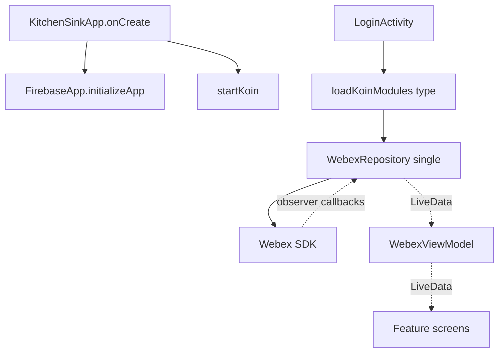
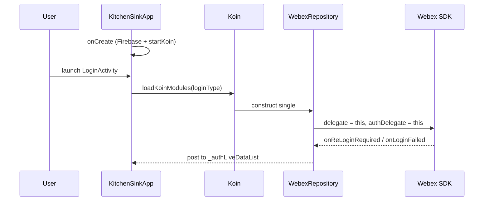
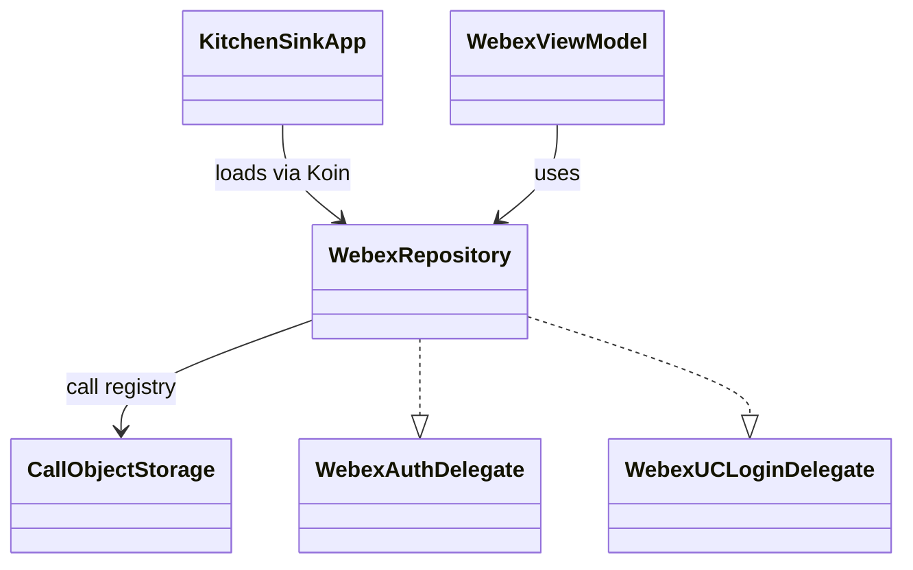

# Core (App Shell) — SPEC

> Start here → root [`AGENTS.md`](../../../../../../../../../AGENTS.md) (agent entry) · router [`SPEC_INDEX.md`](../../../../../../../../../ai-docs/SPEC_INDEX.md) · system [`ARCHITECTURE.md`](../../../../../../../../../ai-docs/ARCHITECTURE.md). This is the module's canonical spec.
> Context-efficiency: link to canonical docs — don't duplicate them; load specs on demand per `SPEC_INDEX.md`.

## Metadata
| Field | Value |
|---|---|
| Module id | `core` |
| Source path(s) | `app/src/main/java/com/ciscowebex/androidsdk/kitchensink/` (top-level files: `KitchenSinkApp.kt`, `WebexRepository.kt`, `WebexViewModel.kt`, `WebexModule.kt`, `BaseActivity.kt`, `BaseViewModel.kt`, service classes) |
| Doc kind | Module spec |
| Coverage score | Pending coverage assessment |
| Generated from | `module-spec` @ SDLC template library `0.2.1` |
| generated_by / approved_by / updated_at | claude-cli / pending / 2026-07-31T00:00:00Z |
| Validation status | not-run |

## Evidence Rules
Every requirement below cites concrete source evidence using `file path`. Assess-only onboarding: this module is `Untracked` in `.sdd/manifest.json`; code is authoritative. Unresolved facts are marked `[NEEDS HUMAN INPUT]`.

## Source Material Register
| Source material | Scope | Decision | Detail location or disposition |
|---|---|---|---|
| Current Kotlin source (`KitchenSinkApp.kt`, `WebexRepository.kt`, `WebexViewModel.kt`, `WebexModule.kt`) | overview / architecture | used | Placed across Overview, Design, Data Flow, and Sequence sections |
| No prior SDD/design specs | none | none | First onboarding; no migration performed |

## Overview
The core (app-shell) module owns application startup and the shared plumbing every feature depends on. `KitchenSinkApp` is the Android `Application`: it initializes Firebase, starts Koin, observes the process lifecycle, and loads/unloads the feature Koin modules based on the saved login type (`KitchenSinkApp.kt`). The core also owns the `Webex` SDK client construction (`buildCrashEnabledWebex`) and the shared `WebexRepository`/`WebexViewModel` registered in `webexModule` (`WebexModule.kt`).

`WebexRepository` is the single hub that binds to the Webex SDK: it sets itself as the SDK auth and UC-login delegate, registers space/membership/message/calendar/call observers, and republishes their callbacks as `LiveData` and event enums (`WebexRepository.kt`). `WebexViewModel` exposes SDK operations and `LiveData` streams to the screens (`WebexViewModel.kt`). A maintainer changing cross-feature behavior (auth callbacks, call registry, DI wiring) starts here.

## Purpose / Responsibility
Owns app lifecycle, dependency-injection wiring, the shared Webex SDK client, and the shared repository/view-model that mediate all SDK access. It does NOT own any single feature's UI (those live in `auth/`, `calling/`, `messaging/`, etc.).

## Stack
Kotlin 2.1.20 (Java 17), Android; Koin DI; AndroidX Lifecycle (`ProcessLifecycleOwner`, `LiveData`); Firebase; Webex Android SDK (`WebexModule.kt`, `Dependencies.kt`).

## Folder / Package Structure
```
app/src/main/java/com/ciscowebex/androidsdk/kitchensink/
├── KitchenSinkApp.kt        # Application: Firebase + Koin init, module load/unload per login type
├── WebexModule.kt           # core Koin module (webexModule) + buildCrashEnabledWebex
├── WebexRepository.kt        # SDK delegate/observer hub; LiveData + event enums
├── WebexViewModel.kt         # central ViewModel exposing SDK ops and LiveData
├── BaseActivity.kt / BaseViewModel.kt  # shared base classes
├── firebase/                # FCM service + token registration
└── utils/                   # SharedPrefUtils, CallObjectStorage, Constants, helpers
```

## Key Files (source of truth)
| File | Holds |
|---|---|
| `KitchenSinkApp.kt` | App init, Koin module list per `LoginType`, foreground flag |
| `WebexModule.kt` | `webexModule` registrations and SDK client construction |
| `WebexRepository.kt` | SDK auth/UC delegates, observers, call registry, event enums, `LiveData` |
| `utils/CallObjectStorage.kt` | In-memory active-call registry (synchronized) |
| `utils/SharedPrefUtils.kt` | Login-type/email/FedRAMP preference persistence |

## Public Surface
Internal Surface — used by the app's own feature modules; not an externally published contract.
| Contract ID | Type | Surface | Purpose | Compatibility / deprecation | Schema / detail link | Root index |
|---|---|---|---|---|---|---|
| `core.loadKoinModules` | SDK (internal) | `KitchenSinkApp.loadKoinModules(type)` | Load feature Koin modules for a login type | internal | `KitchenSinkApp.kt` | `../../../../../../../../../ai-docs/CONTRACTS.md` |
| `core.webexRepository` | SDK (internal) | `WebexRepository` singleton (Koin) | Shared SDK access + observers | internal | `WebexRepository.kt` | `../../../../../../../../../ai-docs/CONTRACTS.md` |
| `core.webexViewModel` | SDK (internal) | `WebexViewModel` (Koin `viewModel`) | SDK ops + `LiveData` for screens | internal | `WebexViewModel.kt` | `../../../../../../../../../ai-docs/CONTRACTS.md` |

## Requires (dependencies)
Webex Android SDK (`Webex`, `Authenticator`, observers); Koin; Firebase; AndroidX Lifecycle. Feature modules require the core `webexModule` to be loaded before their ViewModels resolve (`KitchenSinkApp.kt`, `WebexModule.kt`).

## Requirements
| ID | WHAT | WHY | Source Evidence | Test / Example Evidence | Assumptions / Gaps | Confidence |
|---|---|---|---|---|---|---|
| `CORE-R-001` | On app start, Firebase is initialized and Koin is started before feature modules load | SDK/DI must be ready before any screen resolves a ViewModel | `KitchenSinkApp.kt` (`onCreate`) | None found | — | PRESENT |
| `CORE-R-002` | Feature Koin modules are loaded as a set keyed by `LoginType` | Each login type needs the same feature set wired consistently | `KitchenSinkApp.kt` (`loadKoinModules`) | None found | — | PRESENT |
| `CORE-R-003` | `WebexRepository` binds itself as the SDK auth and UC-login delegate on construction | Centralizes auth/UC callbacks in one hub | `WebexRepository.kt` (`init`) | None found | — | PRESENT |
| `CORE-R-004` | SDK observer callbacks are re-published to the UI as `LiveData`/event enums | Decouples SDK threading from screens | `WebexRepository.kt` (space/membership/message/calendar observers) | None found | — | PRESENT |
| `CORE-R-005` | The active-call registry is mutated only under synchronization | Prevent races on the shared call list | `utils/CallObjectStorage.kt`; `WebexRepository.setCallObserver` (`@Synchronized`) | None found | — | PRESENT |

## Design Overview
The core follows MVVM with a repository hub. `WebexRepository` is a singleton (Koin `single`) that owns all SDK observer registration and translates SDK callbacks into `LiveData` streams and typed event enums (`CallEvent`, `MessageEvent`, `SpaceEvent`, `MembershipEvent`, `CalendarMeetingEvent`). This keeps SDK-threading and callback wiring in one place so feature ViewModels observe simple streams (`WebexRepository.kt`). DI is centralized in `webexModule`; feature modules are additive and loaded per login type, allowing unload on logout (`KitchenSinkApp.kt`).

## Data Flow


## Sequence Diagram(s)
Sequence coverage:

| Operation group | Diagram | Failure / recovery coverage |
|---|---|---|
| App startup + module load | Startup sequence | `loadModules` returns false when no saved login type |
| SDK callback fan-out | Observer republish sequence | Re-login/login-failed callbacks propagate to `LiveData` list |



## Class / Component Relationships

`WebexViewModel` and every feature repository depend on the shared `WebexRepository`; `WebexRepository` implements the SDK auth/UC delegate interfaces (`WebexRepository.kt`).

## Use Cases
- **UC-1 App start:** app process starts → `KitchenSinkApp.onCreate` initializes Firebase + Koin → lifecycle observer registered. Evidence: `KitchenSinkApp.kt`.
- **UC-2 Load feature modules:** user picks/uses a login type → `loadKoinModules(type)` wires the feature set. Evidence: `KitchenSinkApp.kt`.
- **UC-3 SDK event fan-out:** SDK emits a space/message/call event → repository observer maps it to a `LiveData`/event enum → screen updates. Evidence: `WebexRepository.kt`.

<!-- Include if: this module has a UI [condition-id: module.has_ui] -->
### UI Flow (per use case)
The core provides `BaseActivity`/`BaseViewModel` and the app launcher path; concrete screens live in feature modules. Cross-service flow: startup wires the SDK client used by all feature screens (`WebexModule.kt`).

<!-- Include if: this module crosses service boundaries [condition-id: module.crosses_service_boundaries] -->
### Cross-service flow (per use case)
All SDK access crosses into the Webex SDK / Webex cloud via `WebexRepository` methods (e.g. `webex.spaces.get`, `webex.phone.*`) (`WebexRepository.kt`).

<!-- Include if: this module holds client-side state [condition-id: module.holds_client_state] -->
## State Model
Core holds transient client state: the `CallObjectStorage` active-call list, `WebexRepository` call/UC fields and `MutableLiveData` streams, and the app-level flags (`inForeground`, `isKoinModulesLoaded`, `isUCSSOLogin`) on `KitchenSinkApp` (`KitchenSinkApp.kt`, `WebexRepository.kt`). `clearCallData()` resets call state on teardown.

<!-- Include if: the module is concurrent / async / reactive / event-driven [condition-id: module.is_concurrent_async] -->
## Concurrency & Reactive Flow
SDK callbacks arrive asynchronously and are republished with `postValue` on `LiveData` (`WebexRepository.kt`). The active-call registry uses `synchronized` blocks (`CallObjectStorage.kt`) and `setCallObserver` is `@Synchronized`. Preserve these guards; the same call may be observed from multiple screens.

<!-- Include if: the module returns/raises errors a caller must handle [condition-id: module.returns_caller_errors] -->
## Error Handling & Failure Modes
| Condition | Signal (error/code/result) | Caller recovery |
|---|---|---|
| SDK re-auth needed | `onReLoginRequired` → `RE_LOGIN_REQUIRED` on auth `LiveData` list | Screen routes back to login |
| Login failed | `onLoginFailed` → `LOGIN_FAILED` | Screen shows failure and re-prompts |
| Webex client init throws | caught + logged in `buildCrashEnabledWebex` | Crash reporting stays disabled; app continues |
| No saved login type | `loadModules()` returns false | Caller prompts for login type |

## Pitfalls
- Requesting a feature ViewModel before `loadKoinModules` runs fails DI resolution (`KitchenSinkApp.kt`).
- Bypassing `CallObjectStorage`/`WebexRepository` synchronization risks call-list races (`CallObjectStorage.kt`).
- `WebexRepository` sets itself as the SDK delegate in `init`; constructing two instances would contend for delegates (`WebexRepository.kt`).

## Test-Case Strategy (module)
Assess-only: only example unit scaffolding exists (`app/src/test/java/.../ExampleUnitTest.kt`). Recommended: unit-test `CallObjectStorage` add/remove/synchronization; verify `loadKoinModules` wires the expected module set per `LoginType`.

| Behavior / Requirement | Existing test evidence | Gap |
|---|---|---|
| `CORE-R-002` | None found | No test asserts the per-login-type module set |
| `CORE-R-005` | None found | No concurrency test for the call registry |

## Traceability
- Repo architecture: `../../../../../../../../../ai-docs/ARCHITECTURE.md` · Registry: `../../../../../../../../../ai-docs/SPEC_INDEX.md`
- Coverage state & contracts baseline: `.sdd/manifest.json`
