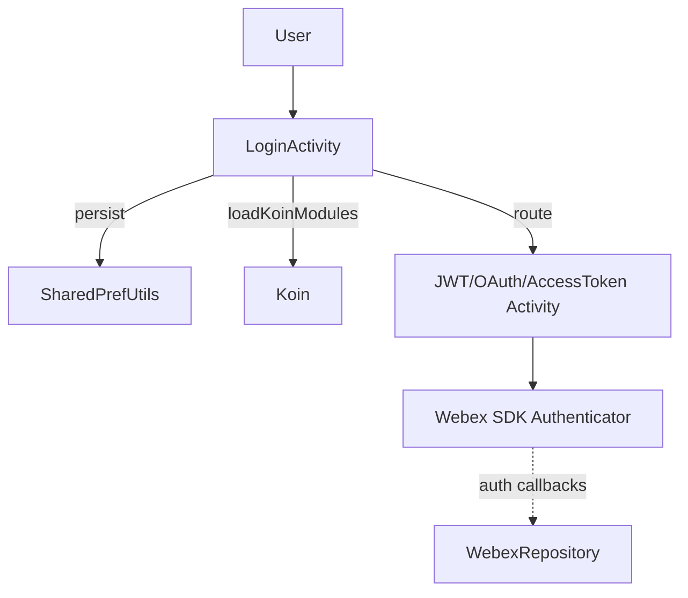
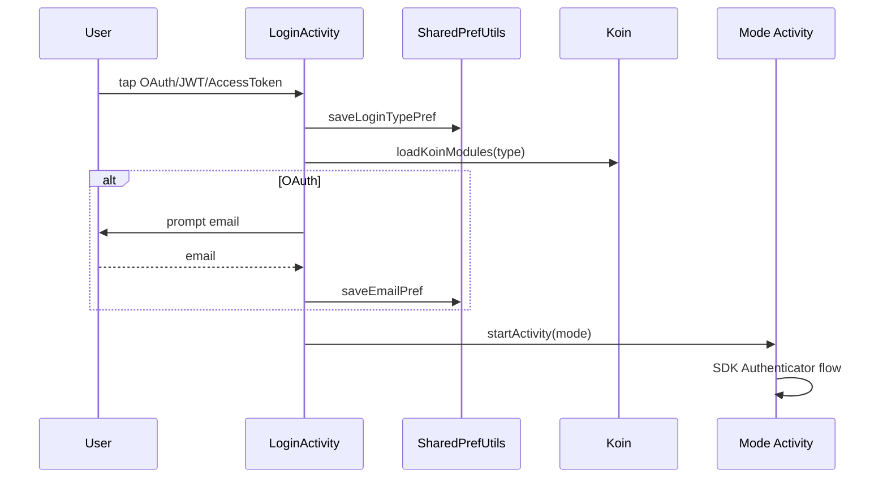
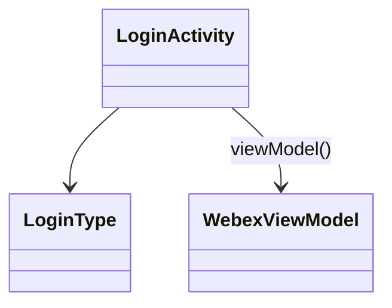

# Auth — SPEC

> Start here → root [`AGENTS.md`](../../../../../../../../../../AGENTS.md) (agent entry) · router [`SPEC_INDEX.md`](../../../../../../../../../../ai-docs/SPEC_INDEX.md) · system [`ARCHITECTURE.md`](../../../../../../../../../../ai-docs/ARCHITECTURE.md). This is the module's canonical spec.
> Context-efficiency: link to canonical docs — don't duplicate them; load specs on demand per `SPEC_INDEX.md`.

## Metadata
| Field | Value |
|---|---|
| Module id | `auth` |
| Source path(s) | `app/src/main/java/com/ciscowebex/androidsdk/kitchensink/auth/` |
| Doc kind | Module spec |
| Coverage score | Pending coverage assessment |
| Generated from | `module-spec` @ SDLC template library `0.2.1` |
| generated_by / approved_by / updated_at | claude-cli / pending / 2026-07-31T00:00:00Z |
| Validation status | not-run |

## Evidence Rules
Every requirement cites `file path` evidence. Assess-only onboarding: module is `Untracked`; code is authoritative. Unresolved facts are `[NEEDS HUMAN INPUT]`.

## Source Material Register
| Source material | Scope | Decision | Detail location or disposition |
|---|---|---|---|
| `auth/LoginActivity.kt` and auth activity declarations in `AndroidManifest.xml` | overview / architecture | used | Placed in Overview, Use Cases, Sequence sections |
| No prior SDD/design specs | none | none | First onboarding |

## Overview
The auth module owns the app's login experience across the authentication modes the Webex SDK supports. `LoginActivity` is the LAUNCHER activity: it presents JWT, OAuth, and Access-Token options, persists the chosen login type, loads the feature Koin modules for it, and routes to the matching login activity (`LoginActivity.kt`, `AndroidManifest.xml`). It also handles FedRAMP gating of the login toggle (`LoginActivity.kt`).

Concrete per-mode screens (`JWTLoginActivity`, `AccessTokenLoginActivity`, `OAuthWebLoginActivity`) and the UC/CUCM path (`cucm.UCLoginActivity`) are declared in the manifest (`AndroidManifest.xml`). Authentication itself is performed by the Webex SDK; auth callbacks (re-login required, login failed, UC connection state) are handled centrally in `WebexRepository` (`WebexRepository.kt`).

## Purpose / Responsibility
Owns login-mode selection, login-type persistence, and routing into the correct SDK authentication flow (OAuth/JWT/Access-Token/UC). It does NOT implement token exchange itself — that is the SDK's `Authenticator`.

## Stack
Kotlin/Android; AndroidX AppCompat + DataBinding (`ActivityLoginBinding`); Koin `viewModel()`; Webex SDK auth APIs (`LoginActivity.kt`).

## Folder / Package Structure
```
app/src/main/java/com/ciscowebex/androidsdk/kitchensink/auth/
├── LoginActivity.kt            # launcher: mode selection + routing + FedRAMP toggle
├── JWTLoginActivity            # JWT login screen (declared in AndroidManifest.xml)
├── AccessTokenLoginActivity    # access-token login screen
├── OAuthWebLoginActivity       # OAuth web login screen
└── (loginModule Koin module registered in KitchenSinkApp.kt)
```

## Key Files (source of truth)
| File | Holds |
|---|---|
| `LoginActivity.kt` | `LoginType` enum, mode selection, `loadKoinModules`, FedRAMP gating |
| `AndroidManifest.xml` | Declared auth activities (JWT/AccessToken/OAuthWeb, UC login) |

## Public Surface
Internal Surface — Android entry activities; no externally published contract.
| Contract ID | Type | Surface | Purpose | Compatibility / deprecation | Schema / detail link | Root index |
|---|---|---|---|---|---|---|
| `auth.LoginActivity` | UI | LAUNCHER activity | Select login mode and route | internal | `LoginActivity.kt` | `../../../../../../../../../../ai-docs/CONTRACTS.md` |
| `auth.LoginType` | SDK (internal) | enum {OAuth, JWT, AccessToken} | Drives which Koin modules + activity are used | internal | `LoginActivity.kt` | `../../../../../../../../../../ai-docs/CONTRACTS.md` |

## Requires (dependencies)
Core `WebexViewModel`/`WebexRepository`; Webex SDK `Authenticator`/`AppConfiguration`/`SettingsStore`; `SharedPrefUtils` for login-type/email/FedRAMP persistence; OAuth credentials from `BuildConfig` (`LoginActivity.kt`, `utils/SharedPrefUtils.kt`, `app/build.gradle`).

## Requirements
| ID | WHAT | WHY | Source Evidence | Test / Example Evidence | Assumptions / Gaps | Confidence |
|---|---|---|---|---|---|---|
| `AUTH-R-001` | User can choose OAuth, JWT, or Access-Token login | Demonstrate all SDK auth modes | `LoginActivity.kt` (`buttonClicked`, `LoginType`) | None found | — | PRESENT |
| `AUTH-R-002` | Selected login type is persisted and reused on next launch | Return users to their last mode | `LoginActivity.kt` (`getLoginTypePref`); `utils/SharedPrefUtils.kt` | None found | — | PRESENT |
| `AUTH-R-003` | Choosing a mode loads the feature Koin modules for it before routing | Feature ViewModels must resolve after login | `LoginActivity.kt` (`loadKoinModules`) | None found | — | PRESENT |
| `AUTH-R-004` | OAuth path collects an email before starting OAuth | SDK OAuth flow keys on user email | `LoginActivity.kt` (`showEmailDialog`, `saveEmailPref`) | None found | — | PRESENT |
| `AUTH-R-005` | FedRAMP restriction disables/locks the FedRAMP toggle | Enforce FedRAMP employee constraints | `LoginActivity.kt` (`AppConfiguration.containsFedRampRestrictions`) | None found | Rotation/enforcement detail SDK-owned | PRESENT |

## Design Overview
`LoginActivity` uses DataBinding to wire three login buttons; each sets `loginTypeCalled` and dispatches. OAuth first collects an email via a dialog, then starts `OAuthWebLoginActivity`; JWT and Access-Token route directly. Before routing, `loadKoinModules(type)` is called so the feature graph is ready, and `enableBackgroundConnection()` is invoked via `WebexViewModel` (`LoginActivity.kt`). The actual credential exchange is delegated to the SDK.

## Data Flow


## Sequence Diagram(s)
Sequence coverage:

| Operation group | Diagram | Failure / recovery coverage |
|---|---|---|
| Login mode selection + routing | Login sequence | Login-failed / re-login callbacks handled in `WebexRepository` |



## Class / Component Relationships


## Use Cases
- **UC-1 OAuth login:** user taps OAuth → email dialog → modules loaded → `OAuthWebLoginActivity`. Evidence: `LoginActivity.kt`.
- **UC-2 JWT / Access-Token login:** user taps JWT/Access-Token → modules loaded → matching activity. Evidence: `LoginActivity.kt`.
- **UC-3 Returning user:** saved login type routes automatically on launch. Evidence: `LoginActivity.kt` (`loadModules`).

<!-- Include if: this module has a UI [condition-id: module.has_ui] -->
### UI Flow (per use case)
Login screen shows three buttons + a FedRAMP toggle; selecting a button hides the button layout and routes to the mode screen (`LoginActivity.toggleButtonsVisibility`, `LoginActivity.kt`).

<!-- Include if: this module crosses service boundaries [condition-id: module.crosses_service_boundaries] -->
### Cross-service flow (per use case)
Each mode activity invokes the Webex SDK `Authenticator`, which contacts Webex identity; results return through `WebexRepository` auth callbacks (`WebexRepository.kt`).

<!-- Include if: this module holds client-side state [condition-id: module.holds_client_state] -->
## State Model
Login type, email, and FedRAMP preference are persisted in Android `SharedPreferences` (`utils/SharedPrefUtils.kt`). `loginTypeCalled` holds the in-flight selection during a login attempt (`LoginActivity.kt`).

<!-- Include if: the module is concurrent / async / reactive / event-driven [condition-id: module.is_concurrent_async] -->
## Concurrency & Reactive Flow
Auth results are asynchronous SDK callbacks surfaced via `WebexViewModel` `LiveData` (auth live-data list in `WebexRepository.kt`). The UI observes these rather than blocking.

<!-- Include if: the module returns/raises errors a caller must handle [condition-id: module.returns_caller_errors] -->
## Error Handling & Failure Modes
| Condition | Signal (error/code/result) | Caller recovery |
|---|---|---|
| Login failed | `onLoginFailed` → `LOGIN_FAILED` on auth `LiveData` | Show failure, re-enable buttons |
| Re-login required | `onReLoginRequired` → `RE_LOGIN_REQUIRED` | Return to login |
| UC login failure | `onUCLoginFailed` → `UCCallEvent.OnUCLoginFailed` | Surface UC error (`WebexRepository.kt`) |

## Pitfalls
- Routing before `loadKoinModules(type)` would leave feature ViewModels unresolved (`LoginActivity.kt`).
- Empty OAuth credentials (`BuildConfig`) silently prevent successful login (`app/build.gradle`).
- FedRAMP toggle is locked (non-clickable) when restrictions apply; do not re-enable it unconditionally (`LoginActivity.kt`).

## Test-Case Strategy (module)
Assess-only: no auth-specific tests found. Recommended: verify login-type persistence round-trips via `SharedPrefUtils`, and that each `LoginType` routes to the correct activity and loads the expected module set.

| Behavior / Requirement | Existing test evidence | Gap |
|---|---|---|
| `AUTH-R-002` | None found | No persistence round-trip test |
| `AUTH-R-003` | None found | No module-load assertion |

## Traceability
- Repo architecture: `../../../../../../../../../../ai-docs/ARCHITECTURE.md` · Registry: `../../../../../../../../../../ai-docs/SPEC_INDEX.md`
- Coverage state & contracts baseline: `.sdd/manifest.json`
