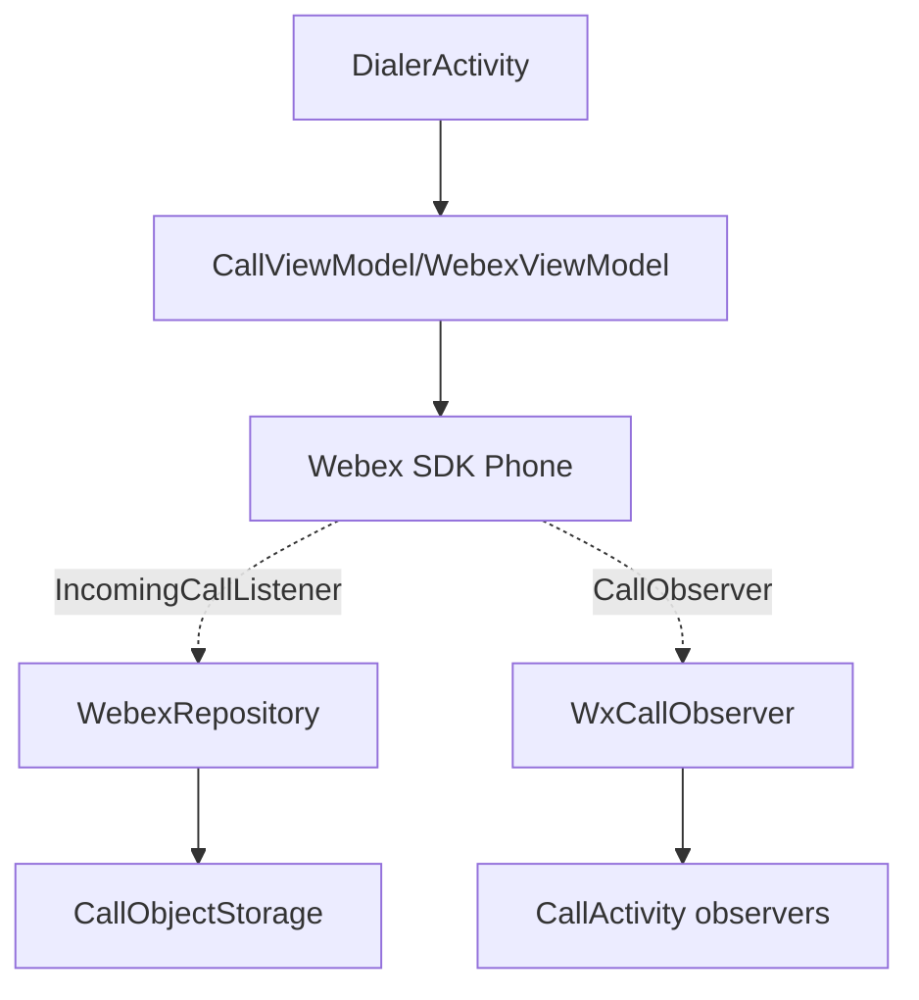
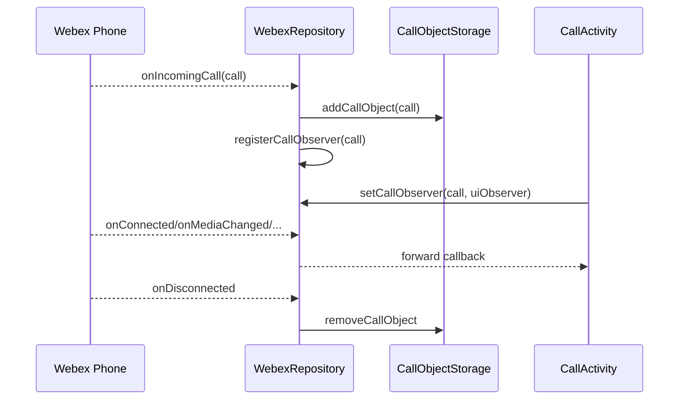
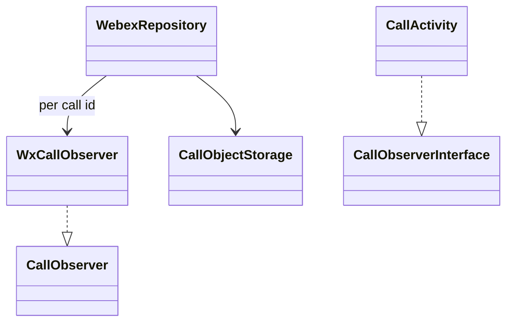
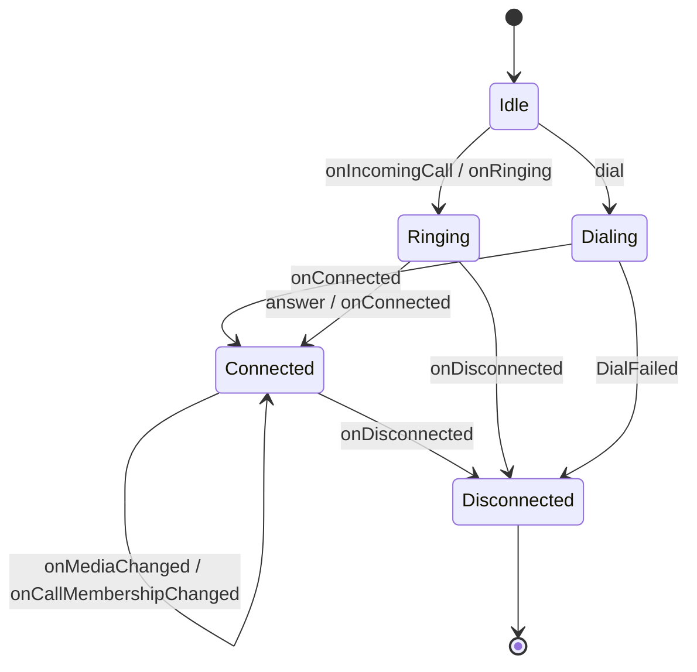

# Calling — SPEC

> Start here → root [`AGENTS.md`](../../../../../../../../../../AGENTS.md) (agent entry) · router [`SPEC_INDEX.md`](../../../../../../../../../../ai-docs/SPEC_INDEX.md) · system [`ARCHITECTURE.md`](../../../../../../../../../../ai-docs/ARCHITECTURE.md). This is the module's canonical spec.
> Context-efficiency: link to canonical docs — don't duplicate them; load specs on demand per `SPEC_INDEX.md`.

## Metadata
| Field | Value |
|---|---|
| Module id | `calling` |
| Source path(s) | `app/src/main/java/com/ciscowebex/androidsdk/kitchensink/calling/` |
| Doc kind | Module spec |
| Coverage score | Pending coverage assessment |
| Generated from | `module-spec` @ SDLC template library `0.2.1` |
| generated_by / approved_by / updated_at | claude-cli / pending / 2026-07-31T00:00:00Z |
| Validation status | not-run |

## Evidence Rules
Every requirement cites `file path` evidence. Assess-only onboarding: module is `Untracked`; code is authoritative. Unresolved facts are `[NEEDS HUMAN INPUT]`.

## Source Material Register
| Source material | Scope | Decision | Detail location or disposition |
|---|---|---|---|
| `calling/CallActivity.kt`, `calling/CallModule.kt`, call observers in `WebexRepository.kt`, calling declarations in `AndroidManifest.xml` | overview / architecture | used | Placed in Overview, Sequence, State Machine sections |
| No prior SDD/design specs | none | none | First onboarding |

## Overview
The calling module owns the app's call and meeting experience: dialing, answering, in-call controls, closed captions, lock-screen/incoming-call handling, CUCM calls, and calendar-meeting details. Its screens are declared in the manifest (`CallActivity`, `CucmCallActivity`, `DialerActivity`, `LockScreenActivity`, closed-captions activities, `CalendarMeetingDetailsActivity`) (`AndroidManifest.xml`). The `callModule` Koin module registers `CallViewModel`, `ClosedCaptionsViewModel`, and `ClosedCaptionsRepository` (`CallModule.kt`).

Call lifecycle is driven by the Webex SDK `Call`/`CallObserver`. `WebexRepository` registers a per-call observer (`WxCallObserver`) that fans out ~30 SDK call callbacks (ringing, connected, disconnected, media/membership changes, breakout sessions, closed captions) to registered observers, and it maintains the active-call registry via `CallObjectStorage` (`WebexRepository.kt`, `utils/CallObjectStorage.kt`).

## Purpose / Responsibility
Owns the demonstration of Webex calling/meeting APIs and the in-call UI. It does NOT own the underlying media stack — that is the Webex SDK `Phone`/`Call`.

## Stack
Kotlin/Android; DataBinding (`ActivityCallBinding`); Picture-in-Picture; foreground/notification services; Webex SDK `phone`/`Call` APIs (`CallActivity.kt`, `AndroidManifest.xml`).

## Folder / Package Structure
```
app/src/main/java/com/ciscowebex/androidsdk/kitchensink/calling/
├── CallActivity.kt                 # in-call UI, PiP, call queue
├── CallModule.kt                   # callModule Koin registrations
├── captions/                       # ClosedCaptions repo + view model + activities
├── calendarMeeting/                # calendar meeting details
└── (Dialer/LockScreen/CucmCall activities declared in AndroidManifest.xml)
```

## Key Files (source of truth)
| File | Holds |
|---|---|
| `CallActivity.kt` | In-call UI, permission handling, PiP, call queue adapter |
| `CallModule.kt` | `callModule` DI registrations |
| `WebexRepository.kt` | `WxCallObserver`, `CallEvent` enum, incoming-call listeners, call registry |
| `utils/CallObjectStorage.kt` | Active `Call` registry |

## Public Surface
Internal Surface — Android call screens/services; no externally published contract.
| Contract ID | Type | Surface | Purpose | Compatibility / deprecation | Schema / detail link | Root index |
|---|---|---|---|---|---|---|
| `calling.CallActivity` | UI | Activity | In-call experience + controls | internal | `CallActivity.kt` | `../../../../../../../../../../ai-docs/CONTRACTS.md` |
| `calling.CallEvent` | SDK (internal) | enum of dial/answer/association outcomes | Signal call operation results to UI | internal | `WebexRepository.kt` | `../../../../../../../../../../ai-docs/CONTRACTS.md` |
| `calling.incomingCallListener` | SDK (internal) | `Phone.IncomingCallListener` registration | Receive incoming calls | internal | `WebexRepository.kt` | `../../../../../../../../../../ai-docs/CONTRACTS.md` |

## Requires (dependencies)
Core `WebexRepository`/`WebexViewModel`; Webex SDK `Phone`/`Call`/`CallObserver`/`MediaOption`; Android permissions (camera/mic/phone) and foreground services; `CallObjectStorage` (`CallActivity.kt`, `WebexRepository.kt`, `AndroidManifest.xml`).

## Requirements
| ID | WHAT | WHY | Source Evidence | Test / Example Evidence | Assumptions / Gaps | Confidence |
|---|---|---|---|---|---|---|
| `CALL-R-001` | Incoming calls are delivered to registered listeners and stored in the call registry | Multiple screens observe the same call | `WebexRepository.kt` (`registerIncomingCallListener`, `setIncomingCallListener`) | None found | — | PRESENT |
| `CALL-R-002` | A per-call observer fans SDK callbacks out to all registered observers for that call | Decouple SDK single-observer model from multiple UI observers | `WebexRepository.kt` (`WxCallObserver`, `setCallObserver`) | None found | — | PRESENT |
| `CALL-R-003` | On disconnect, the call is removed from the registry | Prevent stale call references | `WebexRepository.kt` (`onDisconnected` → `CallObjectStorage.removeCallObject`) | None found | — | PRESENT |
| `CALL-R-004` | Call permissions are requested; pending dial/answer retried after grant | Calls need camera/mic/phone permissions | `CallActivity.kt` (`callingPermissionLauncher`) | None found | — | PRESENT |
| `CALL-R-005` | Closed captions are surfaced during a call | Demonstrate captions API | `WebexRepository.kt` (`onClosedCaptionsArrived`); `calling/captions/` | None found | — | PRESENT |

## Design Overview
`CallActivity` renders the in-call UI, handles runtime permissions via an `ActivityResultContracts.RequestMultiplePermissions` launcher, and supports Picture-in-Picture. Because the SDK `Call` accepts a single observer, `WebexRepository` interposes `WxCallObserver`, which holds a list of `CallObserver`s per call id and forwards every callback; observers register through `setCallObserver` and the first registration triggers `registerCallObserver` on the SDK `Call` (`WebexRepository.kt`).

## Data Flow


## Sequence Diagram(s)
Sequence coverage:

| Operation group | Diagram | Failure / recovery coverage |
|---|---|---|
| Incoming call + observe | Incoming-call sequence | Disconnect removes call from registry |
| Dial/answer | Outbound/answer sequence | Permission-denied → toast; retry on grant |



## Class / Component Relationships


## Use Cases
- **UC-1 Receive & answer:** SDK signals incoming call → registry + observer registered → user answers in `CallActivity`. Evidence: `WebexRepository.kt`, `CallActivity.kt`.
- **UC-2 Place call:** user dials → `Phone` dial → `CallEvent.DialCompleted`/`DialFailed`. Evidence: `WebexRepository.kt` (`CallEvent`).
- **UC-3 Closed captions:** captions arrive during call → surfaced to captions UI. Evidence: `WebexRepository.kt`, `calling/captions/`.

<!-- Include if: this module has a UI [condition-id: module.has_ui] -->
### UI Flow (per use case)
`CallActivity` manages the in-call layout, a call-queue adapter for multiple calls, and PiP transitions (`CallActivity.kt`).

<!-- Include if: this module crosses service boundaries [condition-id: module.crosses_service_boundaries] -->
### Cross-service flow (per use case)
All call operations go through the Webex SDK `Phone`/`Call`, which reaches Webex calling infrastructure; results return via `CallObserver` callbacks (`WebexRepository.kt`).

<!-- Include if: this module holds client-side state [condition-id: module.holds_client_state] -->
## State Model
`WebexRepository` holds call flags (`currentCallId`, `oldCallId`, `isAddedCall`, `isLocalVideoMuted`, `isRemoteScreenShareON`, mute maps) and `CallObjectStorage` holds active `Call`s; `clearCallData()` resets them (`WebexRepository.kt`).

<!-- Include if: the module is concurrent / async / reactive / event-driven [condition-id: module.is_concurrent_async] -->
## Concurrency & Reactive Flow
Call callbacks are asynchronous; `setCallObserver` is `@Synchronized` and `CallObjectStorage` uses `synchronized` blocks. The observer fan-out iterates a per-call observer list; keep it consistent when adding/removing observers (`WebexRepository.kt`, `CallObjectStorage.kt`).

<!-- Include if: the module is stateful with non-trivial transitions [condition-id: module.stateful_transitions] -->
## State Machine

States/transitions are inferred from `CallObserver` callbacks and `CallEvent` outcomes (`WebexRepository.kt`). Terminal `Disconnected` removes the call from the registry.

<!-- Include if: the module returns/raises errors a caller must handle [condition-id: module.returns_caller_errors] -->
## Error Handling & Failure Modes
| Condition | Signal (error/code/result) | Caller recovery |
|---|---|---|
| Dial failed | `CallEvent.DialFailed` | Show error, allow retry |
| Answer needs permission | `CallEvent.AnswerPermissionsRequired` | Request permissions; retry on grant |
| Meeting requires pin/password | `CallEvent.MeetingPinOrPasswordRequired` / `CaptchaRequired` | Prompt for credentials |
| Permission denied | permission launcher result false | Toast `permission_error` (`CallActivity.kt`) |

## Pitfalls
- Registering a UI `CallObserver` without going through `setCallObserver` bypasses the fan-out and misses callbacks (`WebexRepository.kt`).
- Forgetting to remove observers on teardown leaks the per-call observer list (`removeCallObserver`/`clearCallObservers`).
- Foreground/PiP call services must be declared and running for background calls (`AndroidManifest.xml`).

## Test-Case Strategy (module)
Assess-only: no calling tests found. Recommended: unit-test `WxCallObserver` fan-out (positive: all registered observers receive a callback; negative: removed observer does not) and registry removal on disconnect.

| Behavior / Requirement | Existing test evidence | Gap |
|---|---|---|
| `CALL-R-002` | None found | No fan-out test |
| `CALL-R-003` | None found | No disconnect-cleanup test |

## Traceability
- Repo architecture: `../../../../../../../../../../ai-docs/ARCHITECTURE.md` · Registry: `../../../../../../../../../../ai-docs/SPEC_INDEX.md`
- Coverage state & contracts baseline: `.sdd/manifest.json`
