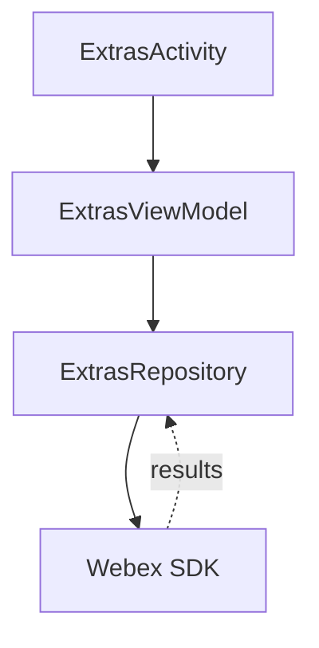
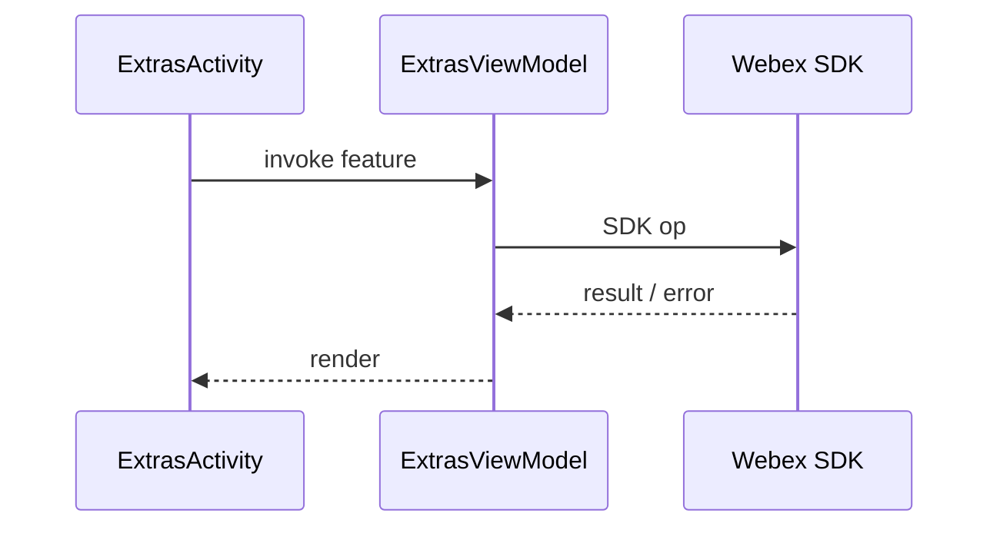
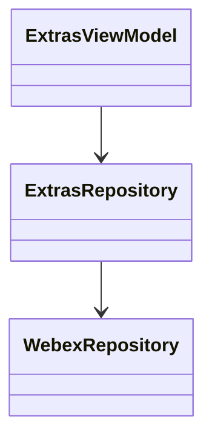

# Extras — SPEC

> Start here → root [`AGENTS.md`](../../../../../../../../../../AGENTS.md) (agent entry) · router [`SPEC_INDEX.md`](../../../../../../../../../../ai-docs/SPEC_INDEX.md) · system [`ARCHITECTURE.md`](../../../../../../../../../../ai-docs/ARCHITECTURE.md). This is the module's canonical spec.
> Context-efficiency: link to canonical docs — don't duplicate them; load specs on demand per `SPEC_INDEX.md`.

## Metadata
| Field | Value |
|---|---|
| Module id | `extras` |
| Source path(s) | `app/src/main/java/com/ciscowebex/androidsdk/kitchensink/extras/` |
| Doc kind | Module spec |
| Coverage score | Pending coverage assessment |
| Generated from | `module-spec` @ SDLC template library `0.2.1` |
| generated_by / approved_by / updated_at | claude-cli / pending / 2026-07-31T00:00:00Z |
| Validation status | not-run |

## Evidence Rules
Every requirement cites `file path` evidence. Assess-only onboarding: module is `Untracked`; code is authoritative. Unresolved facts are `[NEEDS HUMAN INPUT]`.

## Source Material Register
| Source material | Scope | Decision | Detail location or disposition |
|---|---|---|---|
| `extras/ExtrasModule.kt`, `extrasModule` registration in `KitchenSinkApp.kt`, `ExtrasActivity` in `AndroidManifest.xml` | overview / architecture | used | Placed in Overview, Public Surface, Use Cases |
| No prior SDD/design specs | none | none | First onboarding |

## Overview
The extras module hosts miscellaneous SDK feature demonstrations that do not belong to a primary feature area. `extrasModule` registers `ExtrasRepository` and `ExtrasViewModel` (`ExtrasModule.kt`), loaded with the app's feature set (`KitchenSinkApp.kt`). `ExtrasActivity` is the screen (`AndroidManifest.xml`). `[NEEDS HUMAN INPUT]` — the exact set of "extra" SDK features shown is not fully enumerable from the DI wiring alone.

## Purpose / Responsibility
Owns a catch-all screen for auxiliary Webex SDK feature demos. It does NOT own auth, calling, messaging, person, search, or webhooks features (those have dedicated modules).

## Stack
Kotlin/Android; Koin; Webex SDK APIs (`ExtrasModule.kt`).

## Folder / Package Structure
```
app/src/main/java/com/ciscowebex/androidsdk/kitchensink/extras/
├── ExtrasModule.kt      # extrasModule DI (ExtrasViewModel + ExtrasRepository)
├── ExtrasRepository       # auxiliary SDK access
├── ExtrasViewModel        # exposes extras data to UI
└── ExtrasActivity         # extras screen (declared in AndroidManifest.xml)
```

## Key Files (source of truth)
| File | Holds |
|---|---|
| `ExtrasModule.kt` | `extrasModule` DI registrations |
| `AndroidManifest.xml` | `extras.ExtrasActivity` |

## Public Surface
Internal Surface — used by the app; no externally published contract.
| Contract ID | Type | Surface | Purpose | Compatibility / deprecation | Schema / detail link | Root index |
|---|---|---|---|---|---|---|
| `extras.ExtrasViewModel` | SDK (internal) | Koin `viewModel` | Expose extras features to UI | internal | `ExtrasModule.kt` | `../../../../../../../../../../ai-docs/CONTRACTS.md` |
| `extras.ExtrasActivity` | UI | Activity | Extras/miscellaneous demo screen | internal | `AndroidManifest.xml` | `../../../../../../../../../../ai-docs/CONTRACTS.md` |

## Requires (dependencies)
Core `WebexRepository`; Webex SDK APIs (`ExtrasModule.kt`).

## Requirements
| ID | WHAT | WHY | Source Evidence | Test / Example Evidence | Assumptions / Gaps | Confidence |
|---|---|---|---|---|---|---|
| `EXTRAS-R-001` | Extras view model and repository are provided via Koin | Screen resolves extras features through DI | `ExtrasModule.kt` | None found | — | PRESENT |
| `EXTRAS-R-002` | An extras/miscellaneous demo screen exists | Group auxiliary SDK demos | `AndroidManifest.xml` (`ExtrasActivity`) | None found | Exact feature set `[NEEDS HUMAN INPUT]` | PRESENT |

## Design Overview
A repository/ViewModel pair backing a single miscellaneous demo screen. `ExtrasRepository` wraps auxiliary SDK calls; `ExtrasViewModel` exposes results to `ExtrasActivity` (`ExtrasModule.kt`).

## Data Flow


## Sequence Diagram(s)
This is a single-operation-group demo module, so one sequence diagram is sufficient.

Sequence coverage:

| Operation group | Diagram | Failure / recovery coverage |
|---|---|---|
| Invoke an extra SDK feature | Extras sequence | SDK failure surfaced to UI |



## Class / Component Relationships


## Use Cases
- **UC-1 Try an extra feature:** user opens `ExtrasActivity` → invokes an auxiliary SDK feature → result shown. Evidence: `ExtrasModule.kt`, `AndroidManifest.xml`.

<!-- Include if: this module has a UI [condition-id: module.has_ui] -->
### UI Flow (per use case)
`ExtrasActivity` presents auxiliary demos. `[NEEDS HUMAN INPUT]` — whether it spans multiple screens is not determined from code.

<!-- Include if: this module crosses service boundaries [condition-id: module.crosses_service_boundaries] -->
### Cross-service flow (per use case)
Extras operations are served by Webex cloud via the SDK (`ExtrasModule.kt`).

<!-- Include if: this module holds client-side state [condition-id: module.holds_client_state] -->
## State Model
Extras feature state is held transiently in `ExtrasViewModel`.

<!-- Include if: the module is concurrent / async / reactive / event-driven [condition-id: module.is_concurrent_async] -->
## Concurrency & Reactive Flow
Extras operations complete asynchronously via SDK callbacks, exposed through `LiveData`.

<!-- Include if: the module returns/raises errors a caller must handle [condition-id: module.returns_caller_errors] -->
## Error Handling & Failure Modes
| Condition | Signal (error/code/result) | Caller recovery |
|---|---|---|
| Feature op failure | `CompletionHandler` result not successful | Show error in UI |

## Pitfalls
- The exact feature set is not discoverable from DI wiring alone; read `ExtrasViewModel`/`ExtrasActivity` before changing behavior.

## Test-Case Strategy (module)
Assess-only: no extras tests found. Recommended: unit-test `ExtrasRepository` per-feature success/failure once the feature set is confirmed.

| Behavior / Requirement | Existing test evidence | Gap |
|---|---|---|
| `EXTRAS-R-001` | None found | No extras-op test |

## Traceability
- Repo architecture: `../../../../../../../../../../ai-docs/ARCHITECTURE.md` · Registry: `../../../../../../../../../../ai-docs/SPEC_INDEX.md`
- Coverage state & contracts baseline: `.sdd/manifest.json`
