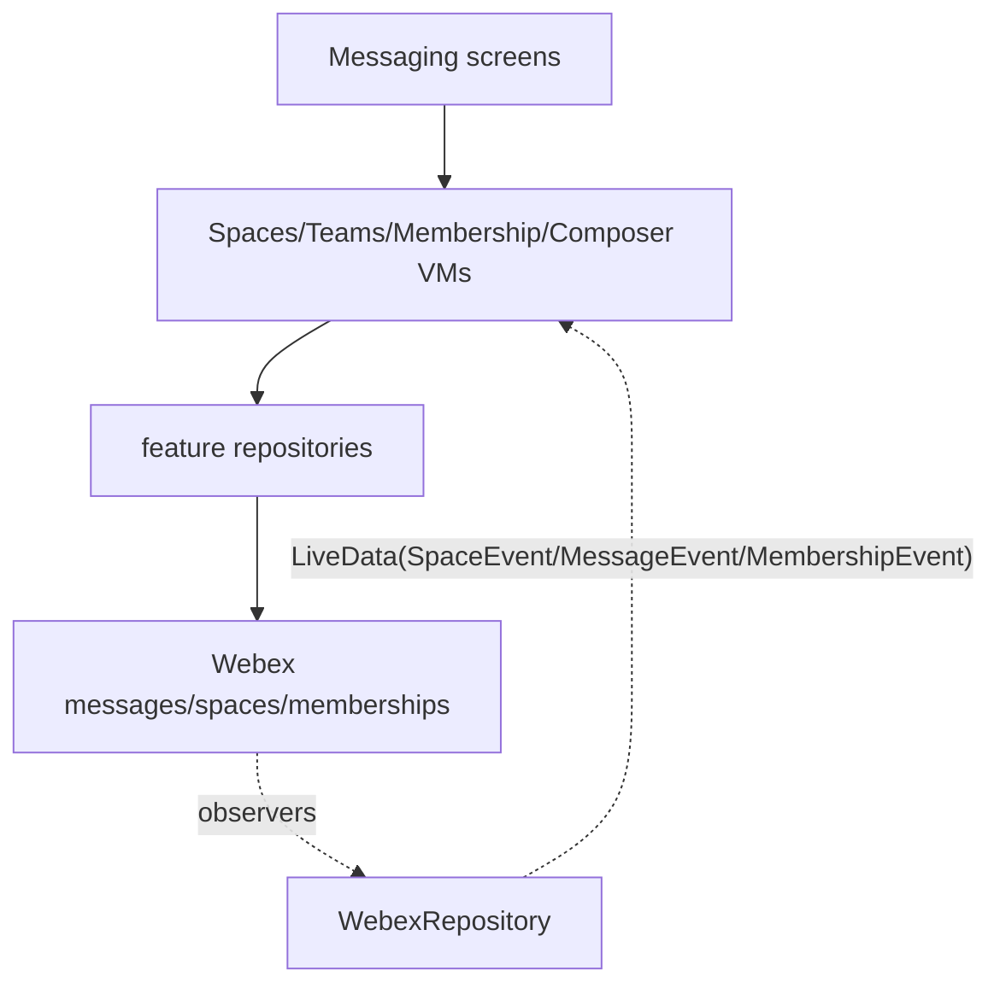
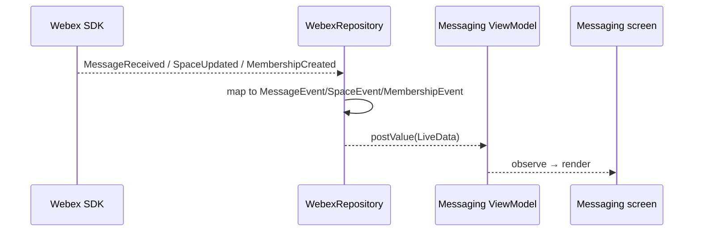
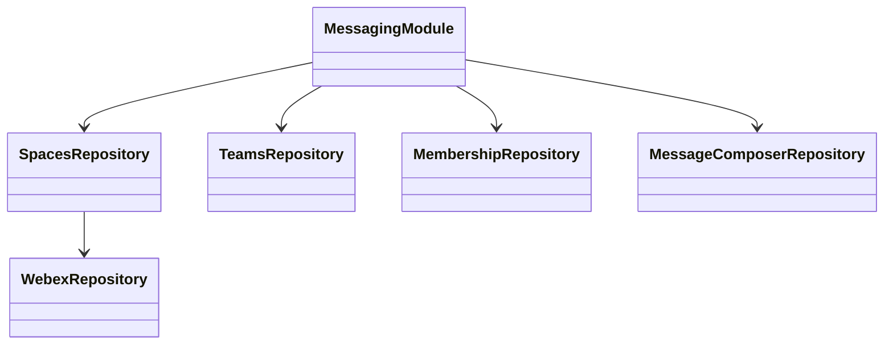

# Messaging — SPEC

> Start here → root [`AGENTS.md`](../../../../../../../../../../AGENTS.md) (agent entry) · router [`SPEC_INDEX.md`](../../../../../../../../../../ai-docs/SPEC_INDEX.md) · system [`ARCHITECTURE.md`](../../../../../../../../../../ai-docs/ARCHITECTURE.md). This is the module's canonical spec.
> Context-efficiency: link to canonical docs — don't duplicate them; load specs on demand per `SPEC_INDEX.md`.

## Metadata
| Field | Value |
|---|---|
| Module id | `messaging` |
| Source path(s) | `app/src/main/java/com/ciscowebex/androidsdk/kitchensink/messaging/` |
| Doc kind | Module spec |
| Coverage score | Pending coverage assessment |
| Generated from | `module-spec` @ SDLC template library `0.2.1` |
| generated_by / approved_by / updated_at | claude-cli / pending / 2026-07-31T00:00:00Z |
| Validation status | not-run |

## Evidence Rules
Every requirement cites `file path` evidence. Assess-only onboarding: module is `Untracked`; code is authoritative. Unresolved facts are `[NEEDS HUMAN INPUT]`.

## Source Material Register
| Source material | Scope | Decision | Detail location or disposition |
|---|---|---|---|
| `messaging/MessagingModule.kt`, messaging activities in `AndroidManifest.xml`, message/space/membership observers in `WebexRepository.kt` | overview / architecture | used | Placed in Overview, Public Surface, Sequence sections |
| No prior SDD/design specs | none | none | First onboarding |

## Overview
The messaging module owns the app's spaces, teams, memberships, and message-composition experience. `messagingModule` registers the ViewModels and Repositories for teams (`TeamsRepository`/`TeamsViewModel`, team detail/membership), spaces (`SpacesRepository`/`SpacesViewModel`, space detail, read-status), memberships (`MembershipRepository`/`MembershipViewModel`, read-status), and the message composer (`MessageComposerRepository`/`MessageComposerViewModel`) (`MessagingModule.kt`). Its screens are declared in the manifest (`MessagingActivity`, `TeamDetailActivity`, `SpaceDetailActivity`, `MembershipActivity`, `MessageComposerActivity`, etc.) (`AndroidManifest.xml`).

Space, membership, and message change events flow through the SDK observers registered in `WebexRepository` (`setSpaceObserver`, `setMembershipObserver`, `setMessageObserver`), which map SDK events to `SpaceEvent`/`MembershipEvent`/`MessageEvent` enums republished as `LiveData` (`WebexRepository.kt`).

## Purpose / Responsibility
Owns the demonstration of Webex messaging APIs (spaces, teams, memberships, messages) and their UI. It does NOT own message persistence — messages/spaces are fetched from Webex via the SDK.

## Stack
Kotlin/Android; DataBinding; RecyclerView; Koin; Webex SDK `messages`/`spaces`/`memberships` APIs (`MessagingModule.kt`, `WebexRepository.kt`).

## Folder / Package Structure
```
app/src/main/java/com/ciscowebex/androidsdk/kitchensink/messaging/
├── MessagingModule.kt          # messagingModule DI registrations
├── spaces/                     # SpacesRepository/ViewModel, detail, members, read-status, listeners
├── teams/                      # TeamsRepository/ViewModel, detail, membership
├── composer/                   # MessageComposerRepository/ViewModel
└── search/                     # MessagingSearchActivity
```

## Key Files (source of truth)
| File | Holds |
|---|---|
| `MessagingModule.kt` | All messaging DI registrations |
| `WebexRepository.kt` | `SpaceEvent`/`MembershipEvent`/`MessageEvent` enums + observers + `listMessages`/`getSpace` |
| `spaces/listeners/SpaceEventListener` | Space event callback surface |

## Public Surface
Internal Surface — Android messaging screens; no externally published contract.
| Contract ID | Type | Surface | Purpose | Compatibility / deprecation | Schema / detail link | Root index |
|---|---|---|---|---|---|---|
| `messaging.MessageEvent` | SDK (internal) | enum {Received, Edited, Deleted, MessageThumbnailUpdated, Updated} | Signal message changes to UI | internal | `WebexRepository.kt` | `../../../../../../../../../../ai-docs/CONTRACTS.md` |
| `messaging.SpaceEvent` | SDK (internal) | enum {Created, Updated, CallStarted, CallEnded} | Signal space changes | internal | `WebexRepository.kt` | `../../../../../../../../../../ai-docs/CONTRACTS.md` |
| `messaging.MembershipEvent` | SDK (internal) | enum {Created, Updated, Deleted, MessageSeen} | Signal membership changes | internal | `WebexRepository.kt` | `../../../../../../../../../../ai-docs/CONTRACTS.md` |

## Requires (dependencies)
Core `WebexRepository`; Webex SDK `webex.messages`/`webex.spaces`/`webex.memberships`; `SpaceEventListener` (`WebexRepository.kt`, `MessagingModule.kt`).

## Requirements
| ID | WHAT | WHY | Source Evidence | Test / Example Evidence | Assumptions / Gaps | Confidence |
|---|---|---|---|---|---|---|
| `MSG-R-001` | Space create/update/call events are observed and republished as `SpaceEvent` | UI reflects live space changes | `WebexRepository.kt` (`setSpaceObserver`) | None found | — | PRESENT |
| `MSG-R-002` | Membership create/update/delete/seen events are republished as `MembershipEvent` | UI reflects membership changes | `WebexRepository.kt` (`setMembershipObserver`) | None found | — | PRESENT |
| `MSG-R-003` | Message received/edited/deleted/updated events are republished as `MessageEvent` | UI reflects live messages | `WebexRepository.kt` (`setMessageObserver`) | None found | — | PRESENT |
| `MSG-R-004` | Messages for a space can be listed | Populate a space's message list | `WebexRepository.kt` (`listMessages`) | None found | Hardcoded max 10000 | PRESENT |
| `MSG-R-005` | Space call started/ended toggles `isSpaceCallStarted`/`spaceCallId` | Coordinate space-call UI | `WebexRepository.kt` (`setSpaceObserver`) | None found | — | PRESENT |

## Design Overview
Each messaging concern (teams, spaces, memberships, composer) is a repository + ViewModel pair registered in `messagingModule`; screens obtain their ViewModel via Koin (`MessagingModule.kt`). Live updates are not polled: the shared `WebexRepository` registers SDK observers once and pushes typed events through `LiveData`, which the messaging screens observe (`WebexRepository.kt`).

## Data Flow


## Sequence Diagram(s)
Sequence coverage:

| Operation group | Diagram | Failure / recovery coverage |
|---|---|---|
| Live message/space/membership updates | Observer republish sequence | SDK event with null payload guarded in observer |



## Class / Component Relationships


## Use Cases
- **UC-1 List spaces & messages:** open messaging → list spaces → open a space → `listMessages`. Evidence: `WebexRepository.kt`, `MessagingModule.kt`.
- **UC-2 Live message update:** message arrives → `MessageEvent.Received` → list updates. Evidence: `WebexRepository.kt`.
- **UC-3 Compose/send:** composer view model sends a message via SDK. Evidence: `messaging/composer/`.

<!-- Include if: this module has a UI [condition-id: module.has_ui] -->
### UI Flow (per use case)
Multi-screen flow across spaces/teams lists, detail, memberships, read-status, and composer activities (`AndroidManifest.xml`).

<!-- Include if: this module crosses service boundaries [condition-id: module.crosses_service_boundaries] -->
### Cross-service flow (per use case)
All messaging operations go through the Webex SDK to Webex cloud; changes return through SDK observers (`WebexRepository.kt`).

<!-- Include if: this module holds client-side state [condition-id: module.holds_client_state] -->
## State Model
Transient: `spaceEventListener`, `isSpaceCallStarted`, `spaceCallId`, and the message/space/membership `LiveData` streams in `WebexRepository` (`WebexRepository.kt`); `clearSpaceData()` clears the listener. Screen lists are held in their ViewModels.

<!-- Include if: the module is concurrent / async / reactive / event-driven [condition-id: module.is_concurrent_async] -->
## Concurrency & Reactive Flow
Observer callbacks are asynchronous and posted via `postValue`; null payloads are guarded in the observers (`WebexRepository.kt`). Screens must observe on the main thread via `LiveData`.

<!-- Include if: the module returns/raises errors a caller must handle [condition-id: module.returns_caller_errors] -->
## Error Handling & Failure Modes
| Condition | Signal (error/code/result) | Caller recovery |
|---|---|---|
| SDK list/get failure | `CompletionHandler` result not successful | Surface error in UI |
| Null event payload | guarded in observer branches | Event ignored (`WebexRepository.kt`) |

## Pitfalls
- `listMessages` uses a hardcoded max of 10000; large spaces may need paging (`WebexRepository.kt`).
- Observers are registered on the shared repository; registering duplicates elsewhere could double-handle events.

## Test-Case Strategy (module)
Assess-only: no messaging tests found. Recommended: unit-test observer→`LiveData` mapping for each `MessageEvent`/`SpaceEvent`/`MembershipEvent` branch (positive: correct enum posted; negative: null payload ignored).

| Behavior / Requirement | Existing test evidence | Gap |
|---|---|---|
| `MSG-R-003` | None found | No message-event mapping test |
| `MSG-R-001` | None found | No space-event mapping test |

## Traceability
- Repo architecture: `../../../../../../../../../../ai-docs/ARCHITECTURE.md` · Registry: `../../../../../../../../../../ai-docs/SPEC_INDEX.md`
- Coverage state & contracts baseline: `.sdd/manifest.json`
