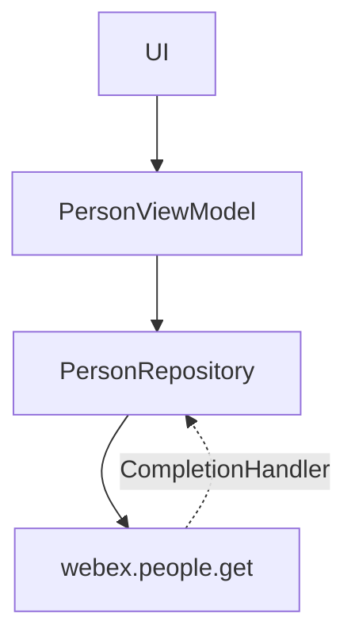
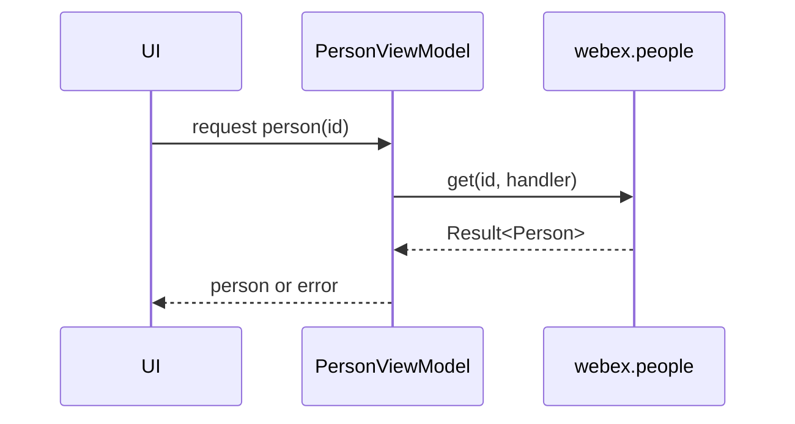
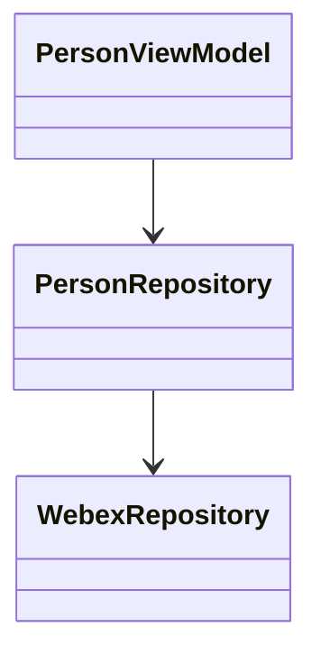

# Person — SPEC

> Start here → root [`AGENTS.md`](../../../../../../../../../../AGENTS.md) (agent entry) · router [`SPEC_INDEX.md`](../../../../../../../../../../ai-docs/SPEC_INDEX.md) · system [`ARCHITECTURE.md`](../../../../../../../../../../ai-docs/ARCHITECTURE.md). This is the module's canonical spec.
> Context-efficiency: link to canonical docs — don't duplicate them; load specs on demand per `SPEC_INDEX.md`.

## Metadata
| Field | Value |
|---|---|
| Module id | `person` |
| Source path(s) | `app/src/main/java/com/ciscowebex/androidsdk/kitchensink/person/` |
| Doc kind | Module spec |
| Coverage score | Pending coverage assessment |
| Generated from | `module-spec` @ SDLC template library `0.2.1` |
| generated_by / approved_by / updated_at | claude-cli / pending / 2026-07-31T00:00:00Z |
| Validation status | not-run |

## Evidence Rules
Every requirement cites `file path` evidence. Assess-only onboarding: module is `Untracked`; code is authoritative. Unresolved facts are `[NEEDS HUMAN INPUT]`.

## Source Material Register
| Source material | Scope | Decision | Detail location or disposition |
|---|---|---|---|
| `person/PersonModule.kt`, `personModule` registration in `KitchenSinkApp.kt`, `webex.people` usage in `WebexRepository.kt` | overview / architecture | used | Placed in Overview, Public Surface, Use Cases |
| No prior SDD/design specs | none | none | First onboarding |

## Overview
The person module owns retrieval and display of Webex person/user details. `personModule` registers `PersonRepository` and `PersonViewModel` (`PersonModule.kt`), loaded with the app's feature set (`KitchenSinkApp.kt`). Person lookups use the SDK `webex.people` API (e.g. `getPerson` in `WebexRepository.kt`). `PersonModel` is used to carry person data (referenced in `WebexViewModel.kt` token live-data).

## Purpose / Responsibility
Owns person/user detail retrieval and its view model. It does NOT own authentication (see `auth/`) or messaging membership data (see `messaging/`).

## Stack
Kotlin/Android; Koin; Webex SDK `people` API (`PersonModule.kt`, `WebexRepository.kt`).

## Folder / Package Structure
```
app/src/main/java/com/ciscowebex/androidsdk/kitchensink/person/
├── PersonModule.kt      # personModule DI (PersonViewModel + PersonRepository)
├── PersonRepository      # person data access via SDK
├── PersonViewModel        # exposes person data to UI
└── PersonModel            # person data holder
```

## Key Files (source of truth)
| File | Holds |
|---|---|
| `PersonModule.kt` | `personModule` DI registrations |
| `WebexRepository.kt` | `getPerson(personId, handler)` via `webex.people.get` |

## Public Surface
Internal Surface — used by the app; no externally published contract.
| Contract ID | Type | Surface | Purpose | Compatibility / deprecation | Schema / detail link | Root index |
|---|---|---|---|---|---|---|
| `person.getPerson` | SDK (internal) | `WebexRepository.getPerson(id, handler)` | Fetch a person by id | internal | `WebexRepository.kt` | `../../../../../../../../../../ai-docs/CONTRACTS.md` |
| `person.PersonViewModel` | SDK (internal) | Koin `viewModel` | Expose person data to UI | internal | `PersonModule.kt` | `../../../../../../../../../../ai-docs/CONTRACTS.md` |

## Requires (dependencies)
Core `WebexRepository`; Webex SDK `webex.people` (`PersonModule.kt`, `WebexRepository.kt`).

## Requirements
| ID | WHAT | WHY | Source Evidence | Test / Example Evidence | Assumptions / Gaps | Confidence |
|---|---|---|---|---|---|---|
| `PERSON-R-001` | A person can be fetched by id via the SDK | Show user/person details | `WebexRepository.kt` (`getPerson`) | None found | — | PRESENT |
| `PERSON-R-002` | `PersonViewModel`/`PersonRepository` are provided via Koin | Screens resolve person data through DI | `PersonModule.kt` | None found | — | PRESENT |

## Design Overview
A thin repository/ViewModel pair over the SDK `people` API. `PersonRepository` wraps SDK calls; `PersonViewModel` exposes results to the UI. The token/current-user detail is surfaced through `WebexViewModel` (`tokenLiveData` pairs a token with a `PersonModel`) (`WebexViewModel.kt`).

## Data Flow


## Sequence Diagram(s)
This is a trivial pass-through/composition module with a single operation group (fetch person), so one sequence diagram is sufficient.

Sequence coverage:

| Operation group | Diagram | Failure / recovery coverage |
|---|---|---|
| Fetch person | Fetch-person sequence | `CompletionHandler` failure surfaced to UI |



## Class / Component Relationships


## Use Cases
- **UC-1 View person:** UI requests a person by id → SDK `get` → details shown. Evidence: `WebexRepository.kt` (`getPerson`), `PersonModule.kt`.

<!-- Include if: this module has a UI [condition-id: module.has_ui] -->
### UI Flow (per use case)
Person details are presented by `PersonViewModel`-backed screens. `[NEEDS HUMAN INPUT]` — whether person detail is a standalone multi-screen flow or embedded in other screens is not fully determined from code.

<!-- Include if: this module crosses service boundaries [condition-id: module.crosses_service_boundaries] -->
### Cross-service flow (per use case)
Person data is fetched from Webex cloud via `webex.people` (`WebexRepository.kt`).

<!-- Include if: this module holds client-side state [condition-id: module.holds_client_state] -->
## State Model
Person data is held transiently in `PersonViewModel`/`PersonModel`; the current-user token pair is exposed via `WebexViewModel.tokenLiveData` (`WebexViewModel.kt`).

<!-- Include if: the module is concurrent / async / reactive / event-driven [condition-id: module.is_concurrent_async] -->
## Concurrency & Reactive Flow
Person fetch is asynchronous via `CompletionHandler`; results are delivered on the SDK callback and surfaced through `LiveData` (`WebexRepository.kt`, `WebexViewModel.kt`).

<!-- Include if: the module returns/raises errors a caller must handle [condition-id: module.returns_caller_errors] -->
## Error Handling & Failure Modes
| Condition | Signal (error/code/result) | Caller recovery |
|---|---|---|
| Person not found / fetch failure | `CompletionHandler` result not successful | Show error in UI |

## Pitfalls
- Person lookups depend on a valid authenticated session; unauthenticated calls fail at the SDK layer.

## Test-Case Strategy (module)
Assess-only: no person tests found. Recommended: unit-test `PersonRepository` fetch success/failure paths (positive: person returned; negative: error surfaced).

| Behavior / Requirement | Existing test evidence | Gap |
|---|---|---|
| `PERSON-R-001` | None found | No fetch success/failure test |

## Traceability
- Repo architecture: `../../../../../../../../../../ai-docs/ARCHITECTURE.md` · Registry: `../../../../../../../../../../ai-docs/SPEC_INDEX.md`
- Coverage state & contracts baseline: `.sdd/manifest.json`
