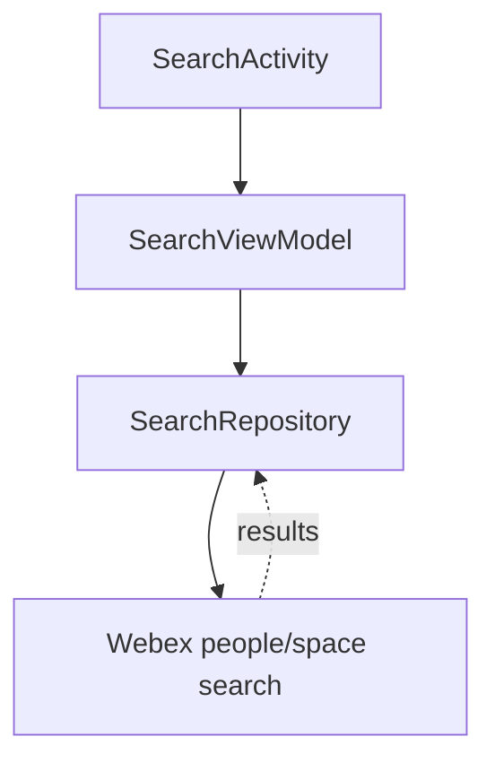
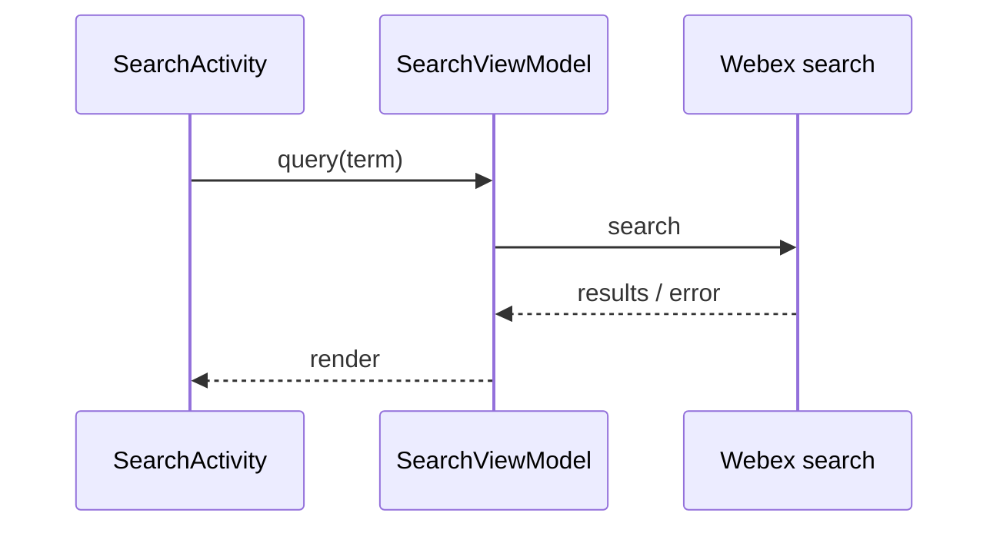
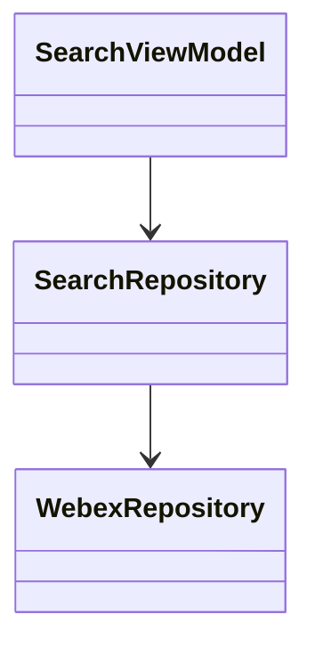

# Search — SPEC

> Start here → root [`AGENTS.md`](../../../../../../../../../../AGENTS.md) (agent entry) · router [`SPEC_INDEX.md`](../../../../../../../../../../ai-docs/SPEC_INDEX.md) · system [`ARCHITECTURE.md`](../../../../../../../../../../ai-docs/ARCHITECTURE.md). This is the module's canonical spec.
> Context-efficiency: link to canonical docs — don't duplicate them; load specs on demand per `SPEC_INDEX.md`.

## Metadata
| Field | Value |
|---|---|
| Module id | `search` |
| Source path(s) | `app/src/main/java/com/ciscowebex/androidsdk/kitchensink/search/` |
| Doc kind | Module spec |
| Coverage score | Pending coverage assessment |
| Generated from | `module-spec` @ SDLC template library `0.2.1` |
| generated_by / approved_by / updated_at | claude-cli / pending / 2026-07-31T00:00:00Z |
| Validation status | not-run |

## Evidence Rules
Every requirement cites `file path` evidence. Assess-only onboarding: module is `Untracked`; code is authoritative. Unresolved facts are `[NEEDS HUMAN INPUT]`.

## Source Material Register
| Source material | Scope | Decision | Detail location or disposition |
|---|---|---|---|
| `search/SearchModule.kt`, `searchModule`/`searchPeopleModule` registration in `KitchenSinkApp.kt`, `SearchActivity`/`MessagingSearchActivity` in `AndroidManifest.xml` | overview / architecture | used | Placed in Overview, Public Surface, Use Cases |
| No prior SDD/design specs | none | none | First onboarding |

## Overview
The search module owns people/space search. `searchModule` registers `SearchViewModel` and `SearchRepository` (`SearchModule.kt`), loaded with the app's feature set (`KitchenSinkApp.kt`). A related `searchPeopleModule` and `MessagingSearchActivity` support people search within messaging; the standalone `SearchActivity` is declared in the manifest (`AndroidManifest.xml`, `KitchenSinkApp.kt`).

## Purpose / Responsibility
Owns search over Webex people/spaces and its view model. It does NOT own the message/space data lifecycle (see `messaging/`).

## Stack
Kotlin/Android; Koin; Webex SDK people/space APIs (`SearchModule.kt`).

## Folder / Package Structure
```
app/src/main/java/com/ciscowebex/androidsdk/kitchensink/search/
├── SearchModule.kt      # searchModule DI (SearchViewModel + SearchRepository)
├── SearchViewModel        # exposes search results to UI
├── SearchRepository       # search access via SDK
└── SearchActivity         # search screen (declared in AndroidManifest.xml)
```

## Key Files (source of truth)
| File | Holds |
|---|---|
| `SearchModule.kt` | `searchModule` DI registrations |
| `AndroidManifest.xml` | `SearchActivity`, `messaging.search.MessagingSearchActivity` |

## Public Surface
Internal Surface — used by the app; no externally published contract.
| Contract ID | Type | Surface | Purpose | Compatibility / deprecation | Schema / detail link | Root index |
|---|---|---|---|---|---|---|
| `search.SearchViewModel` | SDK (internal) | Koin `viewModel` | Expose search results to UI | internal | `SearchModule.kt` | `../../../../../../../../../../ai-docs/CONTRACTS.md` |
| `search.SearchActivity` | UI | Activity | Search screen | internal | `AndroidManifest.xml` | `../../../../../../../../../../ai-docs/CONTRACTS.md` |

## Requires (dependencies)
Core `WebexRepository`; Webex SDK people/space search; `SearchViewModel` composes multiple dependencies (`SearchModule.kt` shows `SearchViewModel(get(), get(), get())`).

## Requirements
| ID | WHAT | WHY | Source Evidence | Test / Example Evidence | Assumptions / Gaps | Confidence |
|---|---|---|---|---|---|---|
| `SEARCH-R-001` | Search view model and repository are provided via Koin | Screens resolve search through DI | `SearchModule.kt` | None found | — | PRESENT |
| `SEARCH-R-002` | A dedicated search screen exists | Demonstrate search UI | `AndroidManifest.xml` (`SearchActivity`) | None found | — | PRESENT |

## Design Overview
A repository/ViewModel pair over the SDK search surfaces. `SearchViewModel` is constructed with three collaborators via Koin (`SearchModule.kt`); the exact search operations are delegated to the SDK. People search is also embedded in messaging via `searchPeopleModule`/`MessagingSearchActivity` (`KitchenSinkApp.kt`, `AndroidManifest.xml`).

## Data Flow


## Sequence Diagram(s)
This is a single-operation-group module (issue query → show results), so one sequence diagram is sufficient.

Sequence coverage:

| Operation group | Diagram | Failure / recovery coverage |
|---|---|---|
| Search query | Search sequence | SDK failure surfaced to UI |



## Class / Component Relationships


## Use Cases
- **UC-1 Search people/spaces:** user enters a term in `SearchActivity` → results shown. Evidence: `SearchModule.kt`, `AndroidManifest.xml`.

<!-- Include if: this module has a UI [condition-id: module.has_ui] -->
### UI Flow (per use case)
`SearchActivity` presents a query input and result list. `[NEEDS HUMAN INPUT]` — whether search spans multiple screens beyond the single activity is not fully determined from code.

<!-- Include if: this module crosses service boundaries [condition-id: module.crosses_service_boundaries] -->
### Cross-service flow (per use case)
Search queries are served by Webex cloud via the SDK (`SearchModule.kt`).

<!-- Include if: this module holds client-side state [condition-id: module.holds_client_state] -->
## State Model
Search terms and results are held transiently in `SearchViewModel`.

<!-- Include if: the module is concurrent / async / reactive / event-driven [condition-id: module.is_concurrent_async] -->
## Concurrency & Reactive Flow
Search results arrive asynchronously via SDK callbacks and are exposed through `LiveData` in the view model.

<!-- Include if: the module returns/raises errors a caller must handle [condition-id: module.returns_caller_errors] -->
## Error Handling & Failure Modes
| Condition | Signal (error/code/result) | Caller recovery |
|---|---|---|
| Search failure | `CompletionHandler` result not successful | Show error / empty state |

## Pitfalls
- Search depends on an authenticated session; results are empty when unauthenticated.

## Test-Case Strategy (module)
Assess-only: no search tests found. Recommended: unit-test `SearchRepository` query success/empty/failure handling.

| Behavior / Requirement | Existing test evidence | Gap |
|---|---|---|
| `SEARCH-R-001` | None found | No search-path test |

## Traceability
- Repo architecture: `../../../../../../../../../../ai-docs/ARCHITECTURE.md` · Registry: `../../../../../../../../../../ai-docs/SPEC_INDEX.md`
- Coverage state & contracts baseline: `.sdd/manifest.json`
