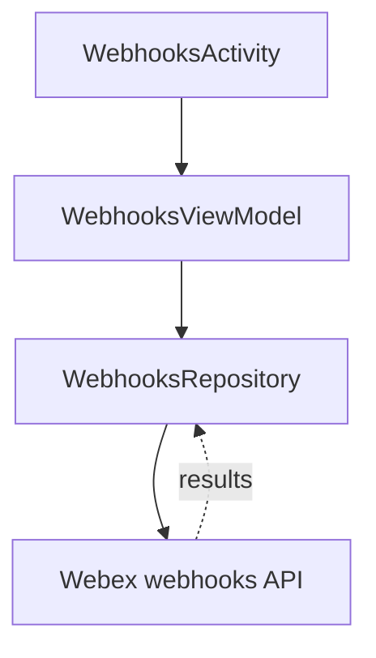
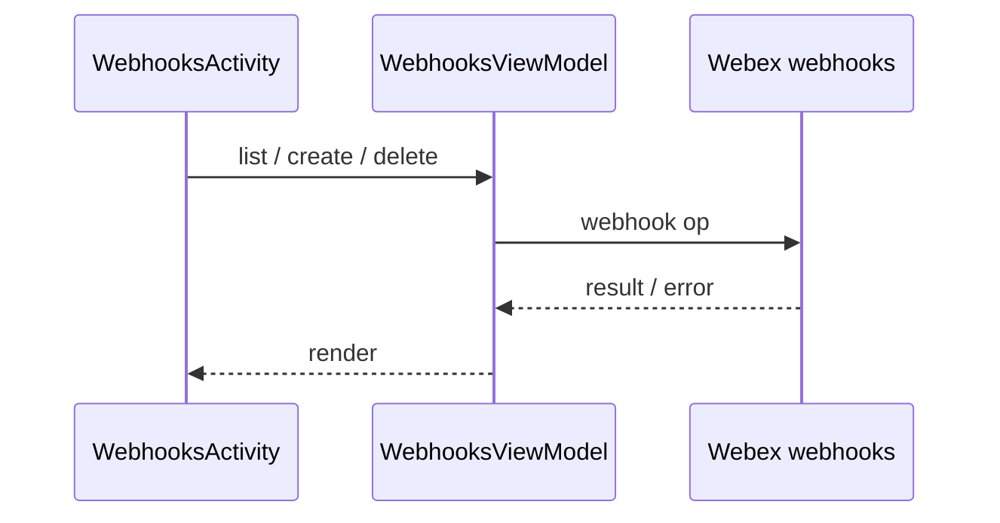
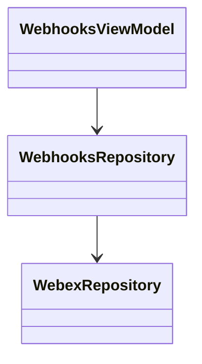

# Webhooks — SPEC

> Start here → root [`AGENTS.md`](../../../../../../../../../../AGENTS.md) (agent entry) · router [`SPEC_INDEX.md`](../../../../../../../../../../ai-docs/SPEC_INDEX.md) · system [`ARCHITECTURE.md`](../../../../../../../../../../ai-docs/ARCHITECTURE.md). This is the module's canonical spec.
> Context-efficiency: link to canonical docs — don't duplicate them; load specs on demand per `SPEC_INDEX.md`.

## Metadata
| Field | Value |
|---|---|
| Module id | `webhooks` |
| Source path(s) | `app/src/main/java/com/ciscowebex/androidsdk/kitchensink/webhooks/` |
| Doc kind | Module spec |
| Coverage score | Pending coverage assessment |
| Generated from | `module-spec` @ SDLC template library `0.2.1` |
| generated_by / approved_by / updated_at | claude-cli / pending / 2026-07-31T00:00:00Z |
| Validation status | not-run |

## Evidence Rules
Every requirement cites `file path` evidence. Assess-only onboarding: module is `Untracked`; code is authoritative. Unresolved facts are `[NEEDS HUMAN INPUT]`.

## Source Material Register
| Source material | Scope | Decision | Detail location or disposition |
|---|---|---|---|
| `webhooks/WebhooksModule.kt`, `webhooksModule` registration in `KitchenSinkApp.kt`, `WebhooksActivity` in `AndroidManifest.xml`, `WEBHOOK_URL` in `app/build.gradle` | overview / architecture | used | Placed in Overview, Public Surface, Use Cases |
| No prior SDD/design specs | none | none | First onboarding |

## Overview
The webhooks module owns the app's webhook-management demonstration. `webhooksModule` registers `WebhooksRepository` and `WebhooksViewModel` (`WebhooksModule.kt`), loaded with the app's feature set (`KitchenSinkApp.kt`). `WebhooksActivity` is the screen (`AndroidManifest.xml`). A configured `WEBHOOK_URL` is available via `BuildConfig` (`app/build.gradle`).

## Purpose / Responsibility
Owns creating/listing/deleting Webex webhooks via the SDK and its UI. It does NOT receive webhook callbacks itself (those go to the configured external URL).

## Stack
Kotlin/Android; Koin; Webex SDK webhooks API (`WebhooksModule.kt`).

## Folder / Package Structure
```
app/src/main/java/com/ciscowebex/androidsdk/kitchensink/webhooks/
├── WebhooksModule.kt       # webhooksModule DI (WebhooksViewModel + WebhooksRepository)
├── WebhooksRepository       # webhook access via SDK
├── WebhooksViewModel        # exposes webhook data to UI
└── WebhooksActivity         # webhook management screen (declared in AndroidManifest.xml)
```

## Key Files (source of truth)
| File | Holds |
|---|---|
| `WebhooksModule.kt` | `webhooksModule` DI registrations |
| `AndroidManifest.xml` | `webhooks.WebhooksActivity` |
| `app/build.gradle` | `WEBHOOK_URL` `BuildConfig` field |

## Public Surface
Internal Surface — used by the app; no externally published contract.
| Contract ID | Type | Surface | Purpose | Compatibility / deprecation | Schema / detail link | Root index |
|---|---|---|---|---|---|---|
| `webhooks.WebhooksViewModel` | SDK (internal) | Koin `viewModel` | Expose webhook data to UI | internal | `WebhooksModule.kt` | `../../../../../../../../../../ai-docs/CONTRACTS.md` |
| `webhooks.WebhooksActivity` | UI | Activity | Webhook management screen | internal | `AndroidManifest.xml` | `../../../../../../../../../../ai-docs/CONTRACTS.md` |

## Requires (dependencies)
Core `WebexRepository`; Webex SDK webhooks API; `WEBHOOK_URL` from `BuildConfig` (`WebhooksModule.kt`, `app/build.gradle`).

## Requirements
| ID | WHAT | WHY | Source Evidence | Test / Example Evidence | Assumptions / Gaps | Confidence |
|---|---|---|---|---|---|---|
| `WEBHOOK-R-001` | Webhook view model and repository are provided via Koin | Screens resolve webhook access through DI | `WebhooksModule.kt` | None found | — | PRESENT |
| `WEBHOOK-R-002` | A webhook management screen exists | Demonstrate webhook CRUD UI | `AndroidManifest.xml` (`WebhooksActivity`) | None found | Exact CRUD ops `[NEEDS HUMAN INPUT]` | PRESENT |

## Design Overview
A repository/ViewModel pair over the SDK webhook surface. `WebhooksRepository` wraps SDK webhook calls; `WebhooksViewModel` exposes results to `WebhooksActivity`. The demo target endpoint comes from the build-time `WEBHOOK_URL` (`app/build.gradle`).

## Data Flow


## Sequence Diagram(s)
This is a single-operation-group module (manage webhooks), so one sequence diagram is sufficient.

Sequence coverage:

| Operation group | Diagram | Failure / recovery coverage |
|---|---|---|
| Manage webhooks | Webhook sequence | SDK failure surfaced to UI |



## Class / Component Relationships


## Use Cases
- **UC-1 Manage webhooks:** user opens `WebhooksActivity` → lists/creates/deletes webhooks via SDK. Evidence: `WebhooksModule.kt`, `AndroidManifest.xml`.

<!-- Include if: this module has a UI [condition-id: module.has_ui] -->
### UI Flow (per use case)
`WebhooksActivity` presents webhook management on a single screen.

<!-- Include if: this module crosses service boundaries [condition-id: module.crosses_service_boundaries] -->
### Cross-service flow (per use case)
Webhook operations are served by Webex cloud via the SDK; delivered webhook events go to the external `WEBHOOK_URL`, not to the app (`app/build.gradle`).

<!-- Include if: this module holds client-side state [condition-id: module.holds_client_state] -->
## State Model
Webhook list/state is held transiently in `WebhooksViewModel`.

<!-- Include if: the module is concurrent / async / reactive / event-driven [condition-id: module.is_concurrent_async] -->
## Concurrency & Reactive Flow
Webhook operations complete asynchronously via SDK callbacks, exposed through `LiveData`.

<!-- Include if: the module returns/raises errors a caller must handle [condition-id: module.returns_caller_errors] -->
## Error Handling & Failure Modes
| Condition | Signal (error/code/result) | Caller recovery |
|---|---|---|
| Webhook op failure | `CompletionHandler` result not successful | Show error in UI |

## Pitfalls
- An empty/invalid `WEBHOOK_URL` makes created webhooks non-functional (`app/build.gradle`).

## Test-Case Strategy (module)
Assess-only: no webhook tests found. Recommended: unit-test `WebhooksRepository` list/create/delete success and failure paths.

| Behavior / Requirement | Existing test evidence | Gap |
|---|---|---|
| `WEBHOOK-R-001` | None found | No webhook-op test |

## Traceability
- Repo architecture: `../../../../../../../../../../ai-docs/ARCHITECTURE.md` · Registry: `../../../../../../../../../../ai-docs/SPEC_INDEX.md`
- Coverage state & contracts baseline: `.sdd/manifest.json`
